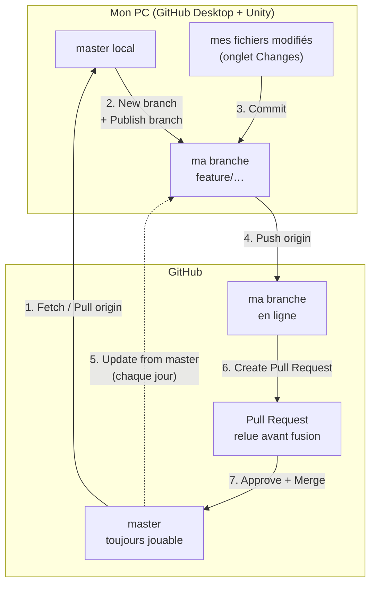
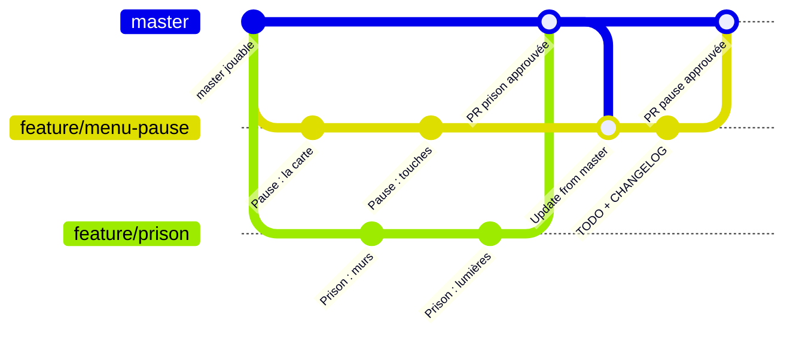
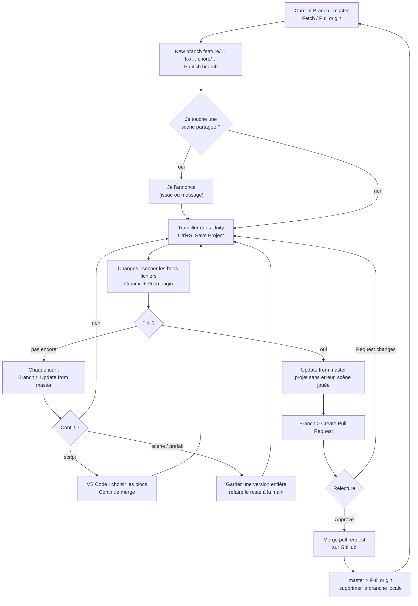

# Travailler en équipe

> Comment on s'organise avec git et GitHub sur UntitledPoolGame : les règles, la mise en place, et le cycle d'une tâche pas à pas dans **GitHub Desktop**. Le pense-bête d'une page est à la fin.

## En bref

- **`master` est toujours jouable.** Personne n'y travaille directement.
- **Une tâche = une branche**, créée depuis `master` et gardée courte (quelques jours au plus).
- **On rentre dans `master` par une Pull Request** (PR). **Un autre membre de l'équipe doit l'approuver** avant la fusion.
- **Une scène partagée = une personne à la fois**, annoncée à l'avance. Pour expérimenter, chacun a ses scènes perso dans `Assets/Scenes/Sandbox/<prénom>/`.
- **On récupère `master` souvent** dans sa branche, pour éviter les grosses surprises.
- **Chaque PR fusionnée est annoncée sur Discord** : son titre, sa description, puis le titre et la description de chaque commit. Ils doivent donc être lisibles par toute l'équipe.

## Le schéma

### Où va le travail

Chaque bouton de GitHub Desktop déplace le travail entre son PC et GitHub. `master` ne reçoit rien directement : tout passe par une branche puis une PR.



### Plusieurs branches en même temps

Chaque tâche a sa branche, partie de `master`. Pendant ce temps, d'autres branches rentrent dans `master` : on les récupère avec *Update from master*, puis sa propre branche rentre à son tour par sa PR.



### Le cycle d'une tâche



## Les règles d'équipe

### Le nom des branches

| Préfixe | Pour quoi | Exemple |
|---|---|---|
| `feature/` | une fonctionnalité, un niveau, un décor | `feature/menu-pause`, `feature/prison` |
| `fix/` | une correction | `fix/camera-chute` |
| `chore/` | l'entretien : doc, site, outils, réglages du dépôt | `chore/schemas-git` |

Écrire en minuscules, avec des tirets, sans accent ni espace. Le nom dit ce que fait la branche.

### Les commits

- **Un commit = une idée.** Committer souvent, plutôt que tout en une fois en fin de journée.
- **Un titre court** (moins de 72 caractères), à l'impératif, en français, qui dit ce qui change : « Ajoute la pause en carte ». Puis une ligne vide et une **description** : ce qui a changé et pourquoi. Dans GitHub Desktop : le champ *Summary* pour le titre, *Description* pour le reste.
- **Pas de commit « wip » ou « fix typo » isolé** : avant d'ouvrir la PR, les regrouper avec le commit qu'ils corrigent.
- **Mettre à jour `TODO.md` et `CHANGELOG.md` dans la même branche** que la fonctionnalité, comme aujourd'hui.
- **Avant de committer, vérifier la liste des fichiers** dans GitHub Desktop. Ne cocher que ce qui concerne la tâche : pas une scène ouverte « pour voir », ni un réglage de Unity modifié par erreur.

### Les scènes et les prefabs

Git fusionne bien le code, mais mal les scènes (`.unity`) et les prefabs. Si deux personnes modifient la même scène en même temps, c'est presque toujours un conflit pénible.

1. **Annoncer avant de modifier une scène partagée** (BarSplitscreen, un niveau…), par une issue GitHub ou un message : « je prends BarSplitscreen jusqu'à ce soir ». Personne d'autre n'y touche pendant ce temps.
2. **Expérimenter dans sa scène Sandbox**, `Assets/Scenes/Sandbox/<prénom>/`. Personne d'autre n'y touche, donc il n'y a jamais de conflit.
3. **Mettre ce qui bouge souvent dans des prefabs.** Modifier un prefab ne touche pas la scène, et deux personnes peuvent travailler sur deux prefabs différents de la même scène.
4. **L'outil de fusion de Unity** (*Smart Merge*) est branché sur git (voir *Mise en place*). Il règle seul la plupart des petits conflits de scènes et de prefabs.

### Ce qu'on ne pousse jamais

- **Les dossiers que Unity recrée tout seul** : `Library/`, `Temp/`, `Logs/`, `UserSettings/`. Ils sont déjà ignorés par git.
- **Les gros packs du Store** : `Assets/Plugins/LeartesStudios` pèse 4,7 Go, contient des fichiers de plus de 100 Mo (refusés par GitHub) et est sous licence. Chacun le réimporte depuis son compte.
- **Un fichier de plus de 100 Mo**, quel qu'il soit : GitHub le refuse.
- **Un mot de passe ou un jeton d'accès**, nulle part, même dans un message de commit.

## Mise en place (une seule fois)

### Pour le propriétaire du dépôt

1. **Inviter les membres de l'équipe** : sur GitHub, *Settings > Collaborators > Add people*. Chacun accepte l'invitation reçue par e-mail.
2. **Protéger `master`** : *Settings > Branches > Add branch protection rule*, avec comme *Branch name pattern* `master`, puis cocher :
   - *Require a pull request before merging* ;
   - *Require approvals* : **1** ;
   - *Do not allow bypassing the above settings*, pour que la règle vaille aussi pour le propriétaire.
3. **Supprimer automatiquement les branches fusionnées** : *Settings > General*, cocher *Automatically delete head branches*.

Le fichier `.gitattributes`, à la racine du dépôt, est déjà en place. Il fixe les fins de ligne et indique à git d'utiliser l'outil de fusion de Unity pour les scènes, les prefabs et les assets. Il n'y a rien à faire de plus.

### Pour chacun

1. **Installer** :
   - **GitHub Desktop**, puis se connecter : *File > Options > Accounts > Sign in*, par le navigateur ;
   - **Unity 6000.6**, la version exacte, via Unity Hub ;
   - **Visual Studio Code**, pour lire et résoudre un conflit dans un script.
2. **Cloner le projet** dans GitHub Desktop :
   - *File > Clone repository > GitHub.com*, choisir `FlackyBoy/UntitledPoolgame` ;
   - comme dossier, `Documents\GitHub` ;
   - le premier téléchargement est long, le dépôt pèse près de 5 Go.
3. **Ouvrir le projet dans Unity Hub** (*Add > Add project from disk*). La première ouverture est longue : Unity reconstruit son cache.
4. **Réimporter les packs qui ne sont pas sur GitHub** depuis son compte Asset Store / Fab : *Window > Package Manager > My Assets* (Haunted Prison de Leartes Studios). Les scènes retrouvent leurs références toutes seules.
5. **Brancher l'outil de fusion de Unity**. Ouvrir PowerShell, coller ces lignes et appuyer sur Entrée. Le script cherche Unity 6000.6 dans Unity Hub et écrit les réglages dans la configuration git de l'utilisateur, que GitHub Desktop lit aussi :

```powershell
$unity = Get-ChildItem "C:\Program Files\Unity\Hub\Editor" -Directory | Where-Object Name -like '6000.6*' | Select-Object -First 1
$merge = Join-Path $unity.FullName "Editor\Data\Tools\UnityYAMLMerge.exe"
if (-not (Test-Path $merge)) { Write-Host "UnityYAMLMerge introuvable : vérifier l'installation de Unity 6000.6" ; return }
$m = $merge -replace '\\', '/'
$cfg = "$env:USERPROFILE\.gitconfig"
if ((Test-Path $cfg) -and (Select-String -Path $cfg -Pattern 'merge "unityyamlmerge"' -Quiet)) { Write-Host "Déjà branché." ; return }
Add-Content $cfg "`n[merge `"unityyamlmerge`"]`n`tname = Unity SmartMerge`n`tdriver = '$m' merge -h -p --force %O %B %A %A`n`trecursive = binary"
Write-Host "Outil de fusion de Unity branché : $merge"
```

6. **Créer son dossier de scènes perso** : `Assets/Scenes/Sandbox/<prénom>/`.

## Le cycle d'une tâche dans GitHub Desktop

### 1. Partir de `master` à jour

1. En haut, menu **Current Branch** : choisir `master`.
2. Cliquer sur **Fetch origin**. S'il apparaît **Pull origin**, cliquer dessus : on récupère le travail de l'équipe.
3. Dans Unity, laisser le projet se recharger.

### 2. Créer sa branche

1. **Current Branch > New branch**.
2. Taper le nom, par exemple `feature/menu-pause`. Laisser *Create branch based on…* sur `master`.
3. Cliquer sur **Create branch**, puis **Publish branch** pour qu'elle existe aussi sur GitHub.

### 3. Travailler et committer

1. Travailler dans Unity, puis enregistrer (*Ctrl + S*, et *File > Save Project*).
2. Dans GitHub Desktop, l'onglet **Changes** liste les fichiers modifiés. **Décocher** ceux qui ne concernent pas la tâche ; clic droit > *Discard changes* pour annuler une modification faite par erreur.
3. En bas à gauche, écrire le **résumé** du commit (et une description si besoin), puis **Commit to feature/menu-pause**.
4. Cliquer sur **Push origin** pour envoyer sur GitHub. On peut le faire à chaque commit : c'est aussi une sauvegarde.

### 4. Récupérer `master` dans sa branche (souvent)

Pendant qu'on travaille, d'autres PR sont fusionnées dans `master`. Pour les récupérer :

1. Rester sur sa branche, puis **Branch > Update from master**.
2. Si GitHub Desktop annonce des **conflits**, voir *Résoudre un conflit* plus bas.
3. Cliquer sur **Push origin**.

À faire au moins une fois par jour, et toujours avant d'ouvrir la PR.

### 5. Ouvrir la Pull Request

1. Vérifier que le projet s'ouvre sans erreur dans la console Unity et que la scène se joue.
2. Dans GitHub Desktop : **Branch > Create Pull Request**. GitHub s'ouvre dans le navigateur.
3. **Titre** : ce que la feature apporte, compréhensible par quelqu'un de non technique (c'est ce qui s'affiche sur Discord). **Description** : 2 à 5 puces sur ce qu'elle apporte. Si besoin, ajouter dessous comment la tester (quelle scène, quelles touches) et ce qui n'est pas fini.
4. **Une PR par feature.**
5. À droite, *Reviewers* : choisir un relecteur dans l'équipe. Puis **Create pull request**.

### 6. Fusionner

1. Quand le relecteur a approuvé (*Approved*), cliquer sur **Merge pull request** sur GitHub (garder « Create a merge commit », pas *Squash* : le détail des commits part sur Discord), puis **Confirm merge**.
2. GitHub supprime la branche en ligne.
3. Dans GitHub Desktop, revenir sur `master` et faire **Pull origin**.
4. Supprimer la branche locale : **Branch > Delete**.

## Relire une PR

1. Sur GitHub, ouvrir la PR, onglet **Files changed** : lire les scripts modifiés. Pour une scène ou un prefab, regarder surtout quels fichiers sont touchés.
2. **Tester** : dans GitHub Desktop, *Current Branch*, onglet **Pull requests**, choisir la PR. GitHub Desktop bascule sur sa branche ; ouvrir Unity et jouer la scène indiquée.
3. Laisser un commentaire sur une ligne (le « + » à gauche de la ligne) ou un commentaire général.
4. **Review changes** :
   - **Approve** si c'est bon ;
   - **Request changes** s'il faut corriger quelque chose : l'auteur de la PR pousse une correction sur la même branche, et la PR se met à jour toute seule.
5. Revenir sur sa propre branche dans GitHub Desktop.

Tant que la PR n'est pas fusionnée, ses changements ne sont pas dans `master`. On peut relire une PR sans perdre son propre travail : il suffit de committer avant de changer de branche, et GitHub Desktop propose de mettre de côté (*stash*) ce qui ne l'est pas.

## Résoudre un conflit

Un conflit arrive quand deux branches ont modifié le même fichier. GitHub Desktop l'annonce pendant *Update from master* et liste les fichiers en conflit.

### Un script (`.cs`) ou un fichier texte

1. Cliquer sur **Open in Visual Studio Code** à côté du fichier.
2. VS Code surligne les deux versions. Choisir pour chaque bloc entre *Accept Current* (la sienne), *Accept Incoming* (celle de `master`) ou *Accept Both*, puis enregistrer.
3. Revenir dans GitHub Desktop : le fichier passe en *Resolved*. Cliquer sur **Continue merge**.

### Une scène ou un prefab

1. Le plus souvent, l'outil de fusion de Unity a déjà tout réglé et il n'y a pas de conflit affiché.
2. S'il en reste un, garder **une** des deux versions entières : clic droit sur le fichier, puis **Use the modified file from master** (celle déjà fusionnée) ou **Use the modified file from feature/…** (la sienne).
3. Refaire ensuite à la main, dans Unity, ce qui manque de la version écartée.
4. Pour que ça n'arrive pas : une scène partagée, une personne à la fois.

En cas de doute, ne rien forcer : **Abort merge** annule tout et remet la branche comme avant.

## Travailler avec Claude Code

Claude suit les mêmes règles, inscrites dans `CLAUDE.md` :
- il travaille sur une branche, jamais directement sur `master` ;
- il committe et pousse uniquement quand on le lui demande ;
- il propose d'ouvrir la PR, et la relecture reste humaine.

Lui dire sur quelle branche on est quand on reprend une tâche.

## Pense-bête

| Quand | Dans GitHub Desktop |
|---|---|
| Je commence une tâche | `master` → **Fetch / Pull origin** → **New branch** (`feature/…`) → **Publish branch** |
| J'ai avancé | **Changes** : cocher les bons fichiers → résumé → **Commit** → **Push origin** |
| Chaque jour | Sur ma branche : **Branch > Update from master** → **Push origin** |
| C'est fini | Projet ouvert sans erreur, scène jouée → **Branch > Create Pull Request** → choisir un relecteur |
| On m'a approuvé | **Merge pull request** sur GitHub → `master` → **Pull origin** → supprimer la branche |
| Je relis | **Current Branch > Pull requests** → tester → **Approve** ou **Request changes** |
| Conflit | Script : VS Code. Scène : garder une version entière, refaire le reste à la main. Doute : **Abort merge** |
| Avant de toucher une scène partagée | L'annoncer. Sinon : ma scène Sandbox |
