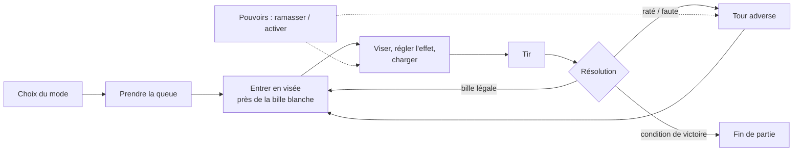

# Game Design Document

> Document vivant, construit à partir de la TODO (état au 29/09/2026). Chaque partie distingue ce qui est **✅ implémenté**, **🔄 en cours** et **📌 décidé mais pas commencé**. Tout ce qui n'est pas encore tranché est dans l'onglet *Pistes & suggestions*.

## 1. Concept

**UntitledPoolGame** est un jeu de billard « friend slop » en vue à la première personne. Les joueurs se déplacent librement dans une salle, prennent une queue en main et jouent de vraies parties de billard… que des pouvoirs, des objets lancés et des dimensions aux règles loufoques viennent détourner.

### Piliers

1. **Un vrai billard comme socle lisible** — physique réaliste et règles connues (8-ball, 9-ball, 14.1) : tout le monde comprend l'objectif avant que le chaos ne commence.
2. **Le chaos entre amis** — pouvoirs de sabotage, objets à lancer sur l'adversaire, ragdoll : le plaisir vient autant des coups tordus que des beaux coups.
3. **Des dimensions qui changent les règles** — chaque dimension apporte son décor et ses propres règles, jusqu'à des modes très éloignés du billard classique.
4. **La liberté FPS** — on marche autour de la table, on ramasse, on lance ; le billard se joue avec le corps du personnage, pas depuis un menu.

### Fiche

| | |
|---|---|
| Genre | Party game / billard physique, vue FPS |
| Joueurs | 2 — écran partagé local ✅ · en ligne 📌 |
| Moteur | Unity 6 (6000.6), URP |
| Contrôles | Clavier/souris et manette |

## 2. Boucle de jeu

### Une partie

1. **Choix du mode** sur l'écran de départ (8-ball, 9-ball, 14.1, Party). ✅
2. Le joueur **prend sa queue** (une queue par joueur, posée près de la table). ✅
3. Près de la bille blanche arrêtée, il **entre en visée** : le personnage se place derrière la queue, la caméra tourne autour de la bille. ✅
4. Il **règle l'angle et le point de frappe** (effet), **charge** la puissance puis relâche. ✅
5. **Résolution** selon les règles du mode : le tour continue, passe à l'adversaire, ou une faute donne la **main libre**. ✅
6. En mode Party, les **pouvoirs** ramassés sur la table s'activent à tout moment pour gêner l'adversaire ou améliorer son tir. ✅

### Boucle méta 📌

Voyager d'une **dimension** à l'autre, chacune avec sa salle, ses règles et ses pouvoirs. Le système de dimensions et le framework de règles par dimension sont décidés mais pas commencés.

## 3. Contrôles

Tels que configurés dans `InputSystem_Actions_Local` (asset d'input du mode local) :

| Action | Clavier / souris | Manette | Usage |
|---|---|---|---|
| Se déplacer | ZQSD/WASD, flèches | Stick gauche | Marcher · en visée : déplacer le point de frappe · vue du dessus : déplacer la bille / changer de poche |
| Regarder | Souris | Stick droit | Caméra FPS · en visée : tourner autour de la bille |
| Interagir | E | Y / △ | Ramasser / poser · entrer / sortir de la visée · valider le placement ou la poche |
| Attaque | Clic gauche, Entrée | X / □ | Maintenir pour charger un tir ou un lancer, relâcher pour tirer |
| Utiliser le pouvoir | F | X / □ | Active le pouvoir en stock |

> ⚠️ Sur manette, **Attaque et Utiliser le pouvoir sont sur le même bouton** (X / □) : charger un tir active aussi le pouvoir. La TODO mentionne « touche 2 / croix droite » pour le pouvoir, ce qui ne correspond plus à l'asset. À corriger.

Sauter, Sprint, S'accroupir et Précédent sont définis dans l'asset mais non utilisés par le jeu.

**Raccourcis de test** : maintenir **C+P** fait rejoindre un second joueur ; **C+W** saute directement à la fin d'une partie de 8-ball (groupes vidés).

## 4. Le joueur

- **Déplacement FPS** maison : le corps tourne avec la caméra, pas de saut. ✅
- **Personnage visible** avec animations de marche / strafe / rotation. ✅ Course, visée, emotes : 📌
- **Ramasser et lancer** n'importe quel objet prévu pour : maintenir Attaque charge le lancer, relâcher lance dans la direction du regard. ✅ Pas encore d'objets à lancer dans le décor (seulement la queue). 🔄
- **La queue** est prise à pleines mains (IK FinalIK) ; en visée, le corps se place derrière elle, la tête suit la bille, et la queue glisse dans les mains pendant la charge. ✅
- **Ragdoll** : un objet lancé qui touche un joueur le fait tomber (PuppetMaster), puis il se relève ; caméra à la 3ᵉ personne pendant la chute. 🔄 (câblage éditeur en cours)

## 5. Le billard

### Physique ✅

Frottement de roulement et de glissement calculés par bille, rebonds vifs sur les bandes, feutre amorti. Effets réels : coulé (topspin), rétro (backspin), effet latéral, obtenus en décalant le point de frappe sur la bille blanche.

### Visée ✅

- Caméra en orbite autour de la bille blanche, rapprochée pendant la charge.
- Ligne de trajectoire jusqu'au premier contact, et direction prise par la bille touchée (pas de rebonds sur bande).
- Si la bille est trop loin des bords pour être atteinte, le tir est bloqué avec un message : il faut contourner la table.

### Règles communes ✅

- **Main libre** après une faute : vue de dessus, le joueur déplace la bille blanche (en évitant les poches) puis valide.
- **Tours** : stricts en écran partagé ; seul, un joueur peut jouer les deux côtés (hot-seat).

## 6. Modes de jeu

| Mode | Règles (version décontractée) | État |
|---|---|---|
| **8-ball** | Groupes pleines / rayées attribués à la première bille empochée. Annonce de poche **uniquement pour la 8**. Empocher la 8 trop tôt, dans la mauvaise poche ou avec la blanche = défaite. | ✅ |
| **9-ball** | Billes 1 à 9 seulement. Toucher d'abord la plus petite bille. Empocher la 9 gagne (sauf avec la blanche = défaite). | ✅ |
| **14.1 continu** | 1 point par bille empochée légalement, premier au score cible. Pas de re-rack. | ✅ |
| **Party — Classique** | 8-ball + pouvoirs. Premier sous-mode Party : d'autres pourront s'ajouter au sous-menu. | ✅ |

D'autres modes aux objectifs propres sont envisagés (voir *Pistes & suggestions*).

## 7. Pouvoirs

### Règles ✅

- **Mode Party uniquement.**
- **Un seul pouvoir en stock par joueur** (façon Mario Kart) : un pouvoir ramassé alors qu'on en a déjà un est perdu.
- **Deux sources** : des **caisses** qui apparaissent sur la table à des emplacements aléatoires et réapparaissent après ramassage, et une **bille à pouvoir** (lumineuse, change régulièrement) qu'il faut empocher.
- **Trois catégories**, chacune avec sa couleur, son matériau et son modèle de caisse : **Attaque**, **Défense**, **Effet**.
- **Activation** avec le bouton de pouvoir. Chaque pouvoir indique s'il est réservé à son propre tour ; les attaques s'utilisent pendant le tour adverse et prennent effet **immédiatement**.

### Pouvoirs implémentés ✅

| Pouvoir | Catégorie | Effet | Durée |
|---|---|---|---|
| **Tir boosté** | Effet | Le prochain tir est plus puissant | Prochain tir |
| **Vision brouillée** | Attaque | L'écran de l'adversaire blanchit et sa visée devient moins sensible | Tour de l'adversaire |
| **Commandes inversées** | Attaque | Regard inversé, sensibilité augmentée, ligne de trajectoire masquée | Tour de l'adversaire |
| **Poche fermée** | Attaque | Une poche au hasard est bouchée | Tour de l'adversaire |

Aucun pouvoir de **Défense** n'existe encore. Une vingtaine d'idées de pouvoirs attendent d'être choisies (voir *Pistes & suggestions*).

## 8. Dimensions et environnements 📌

- **Système de dimensions** : chargement et transition entre « salles » de billard.
- **Règles configurables par dimension**, décrites dans des fichiers de configuration (ScriptableObjects), comme les réglages existants (physique, effets, pouvoirs).
- Contenu prévu, pour valider le système :
  1. une **première dimension jouable** (salle + règles de base) ;
  2. une **deuxième dimension aux règles loufoques** ;
  3. une dimension **« shooter miniature »** : le joueur est réduit sur la table, la queue devient une arme et les billes des ennemis.
- La caméra de visée devra s'adapter à ces changements d'échelle et de vue.

## 9. Combat et PNJ 📌

- La **queue comme arme de mêlée** entre joueurs.
- **PNJ** de base (déplacement, détection du joueur) et **combat FPS** contre eux.

## 10. Multijoueur

- **Écran partagé local, 2 joueurs** : chaque joueur rejoint en appuyant sur un bouton de son appareil, avec sa propre caméra et ses propres contrôles. ✅
- **En ligne** 📌 : Netcode for GameObjects. La couche réseau viendra se poser sur les scripts du mode local, avec un serveur qui fait autorité sur la physique des billes. Transport envisagé : Unity Relay + Lobby.

## 11. Game feel 🔄

Déjà en place, à calibrer en jeu : secousse et zoom pendant la charge, recul et flash au tir, halo et aura sur la poche quand une bille tombe, secousse sur faute et au ramassage d'un pouvoir, léger ralenti à l'empochage.

## 12. Interface actuelle

Toute l'interface est encore provisoire (dessinée avec l'`OnGUI` d'Unity) : écran de choix du mode, tableau des scores, indicateur du point de frappe, messages (poche à annoncer, hors de portée, fin de partie). Elle sera repensée sur la page **Propositions UI**.
