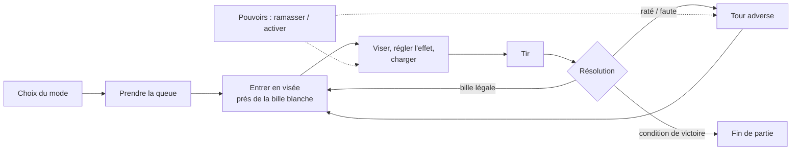

# Game Design Document

> Document vivant, construit à partir de la TODO (état au 02/10/2026). Chaque partie distingue ce qui est **✅ implémenté**, **🔄 en cours** et **📌 décidé mais pas commencé**. Tout ce qui n'est pas encore tranché est dans l'onglet *Pistes & suggestions*.

## 1. Concept

**UntitledPoolGame** est un **jeu de billard loufoque** où le billard n'est qu'un **prétexte** : un prétexte pour vivre des moments de jeu drôles entre amis, façon party game. On joue en vue à la première personne, on se balade dans la salle, on prend une queue… et chaque décor détourne la partie avec son propre twist : horreur dans une prison hantée, billes en apesanteur dans une base spatiale, sabotages, coups et ragdolls.

**Références** : *What the Golf?* (le sport détourné à chaque niveau), *Super Battle Golf* (le sport en chaos entre amis), *Mario Tennis* / *Mario Golf* (un sport accessible rendu spectaculaire par des coups et pouvoirs spéciaux). **Points forts** : le **friend slop** et le **couch coop** (à deux sur le même canapé, en écran partagé), l'aspect **WTF** et drôle.

### Piliers

1. **Le billard comme prétexte** — des règles connues de tous (8-ball, 9-ball, 14.1) : chacun comprend l'objectif avant que tout déraille.
2. **Rire entre amis** — couch coop, sabotages, objets lancés, coups, ragdolls : le plaisir vient autant des coups tordus et des réactions de l'autre que des beaux coups.
3. **Chaque décor, son twist** — un décor change l'ambiance **et** les règles du jeu, jusqu'à des modes très éloignés du billard classique.
4. **Le WTF assumé** — surprises, absurde, situations qu'on raconte après la soirée.
5. **La liberté FPS** — on marche autour de la table, on ramasse, on lance ; le billard se joue avec le corps du personnage.

### Fiche

| | |
|---|---|
| Genre | Party game / billard physique, vue FPS |
| Joueurs | 2 — écran partagé local ✅ · en ligne 📌 |
| Moteur | Unity 6 (6000.6), URP |
| Contrôles | Clavier/souris et manette |

## 2. Boucle de jeu

### Une partie

1. **Choix du mode** dans le menu d'avant-partie (8-ball, 9-ball, 14.1, Party), où l'on choisit en visant et en tirant les billes. ✅ (menu 2D 🔄)
2. Le joueur **prend une queue** : n'importe laquelle, à n'importe quel moment (les queues n'appartiennent à personne ; seul le tir est réservé au joueur dont c'est le tour). ✅
3. Près de la bille blanche arrêtée, il **entre en visée** : le personnage se place derrière la queue, la caméra tourne autour de la bille. ✅
4. Il **règle l'angle et le point de frappe** (effet), **charge** la puissance puis relâche. ✅
5. **Résolution** selon les règles du mode : le tour continue, passe à l'adversaire, ou une faute donne la **main libre**. ✅
6. En mode Party, les **pouvoirs** ramassés sur la table s'activent à tout moment pour gêner l'adversaire ou améliorer son tir. ✅

### Boucle méta 📌

Voyager d'une **dimension** à l'autre, chacune avec sa salle, ses règles et ses pouvoirs. Le système de dimensions et le framework de règles par dimension sont décidés mais pas commencés.

## 3. Contrôles

Le récapitulatif complet des touches clavier / manette, général et selon la situation, est dans l'onglet **[Contrôles](gdd.html#controles)**.

En bref : ZQSD + souris (sticks) pour bouger et regarder, **E / Y** pour interagir, **clic gauche / X** pour le tir, le lancer et le coup de queue, **clic gauche / RB** pour le poing (mains vides), **clic droit / RT** pour le pied, **F / B (○)** pour le pouvoir.

## 4. Le joueur

- **Déplacement FPS** maison : le corps tourne avec la caméra, pas de saut. ✅
- **Personnage visible** avec animations de marche / strafe / rotation. ✅ Course, visée, emotes : 📌
- **Ramasser et lancer** n'importe quel objet prévu pour, **avec les mains** : la main va chercher l'objet (on se penche s'il est bas), un objet léger se tient dans la main droite et part d'un geste du bras, un objet lourd se porte à deux mains et se lance au-dessus de la tête. Maintenir Attaque charge, relâcher lance. 🔄 (en pause, derniers réglages à tester)
- **La queue** se ramasse en tendant les bras vers elle, quelle que soit sa position (au sol, debout, en biais) ; en visée, le corps se place derrière elle et se penche au-dessus de la table pour les coups lointains, la tête suit la bille, la queue glisse dans les mains pendant la charge. ✅
- **Ragdoll** : un coup ou un objet lancé fait tomber le joueur (PuppetMaster), puis il se relève ; la caméra recule à la 3ᵉ personne pendant la chute puis revient dans les yeux pendant le relevé. Le ragdoll ne reste plus coincé au sol ni derrière un mur. ✅

## 5. Le billard

### Physique ✅

Frottement de roulement et de glissement calculés par bille, rebonds vifs sur les bandes, feutre amorti. Effets réels : coulé (topspin), rétro (backspin), effet latéral, obtenus en décalant le point de frappe sur la bille blanche.

### Visée ✅

- Caméra en orbite autour de la bille blanche, rapprochée pendant la charge.
- Ligne de trajectoire jusqu'au premier contact, et direction prise par la bille touchée (pas de rebonds sur bande).
- Le personnage se colle à la table : seul son corps doit rester hors de la table, la queue passe au-dessus de la bande. ✅
- Bille lointaine : **coup allongé** (hanche sur la bande, jambe arrière levée, la visée tremble un peu). Au-delà, le tir est bloqué avec un message : il faut contourner la table (la main avant lâche alors la queue). ✅
- Prévu : coup **derrière le dos** quand la ligne longe la bande côté joueur. 📌

### Règles communes ✅

- **Main libre** après une faute : vue de dessus, le joueur déplace la bille blanche (en évitant les poches) puis valide.
- **Tours** : stricts en écran partagé ; seul, un joueur peut jouer les deux côtés (hot-seat).

## 6. Modes de jeu

| Mode | Règles (version décontractée) | État |
|---|---|---|
| **8-ball** | Groupes pleines / rayées attribués à la première bille empochée. Annonce de poche **uniquement pour la 8**. Empocher la 8 trop tôt, dans la mauvaise poche ou avec la blanche = défaite. | ✅ |
| **9-ball** | Billes 1 à 9 seulement. Toucher d'abord la plus petite bille. Empocher la 9 gagne (sauf avec la blanche = défaite). | ✅ |
| **14.1 continu** | 1 point par bille empochée légalement, premier au score cible. Pas de re-rack. | ✅ |
| **Party — Classique** | 8-ball + pouvoirs. Premier sous-mode Party : d'autres pourront s'ajouter au sous-menu. | ✅ |

D'autres modes aux objectifs propres sont envisagés (voir *Pistes & suggestions*).

## 7. Pouvoirs

### Règles ✅

- **Mode Party uniquement.**
- **Un seul pouvoir en stock par joueur** (façon Mario Kart) : un pouvoir ramassé alors qu'on en a déjà un est perdu.
- **Deux sources** : des **caisses** qui apparaissent sur la table à des emplacements aléatoires et réapparaissent après ramassage, et une **bille à pouvoir** (lumineuse, change régulièrement) qu'il faut empocher.
- **Trois catégories**, chacune avec sa couleur, son matériau et son modèle de caisse : **Attaque**, **Défense**, **Effet**.
- **Activation** avec le bouton de pouvoir. Chaque pouvoir indique s'il est réservé à son propre tour ; les attaques s'utilisent pendant le tour adverse et prennent effet **immédiatement**.

### Pouvoirs implémentés ✅

| Pouvoir | Catégorie | Effet | Durée |
|---|---|---|---|
| **Tir boosté** | Effet | Le prochain tir est plus puissant | Prochain tir |
| **Vision brouillée** | Attaque | L'écran de l'adversaire blanchit et sa visée devient moins sensible | Tour de l'adversaire |
| **Commandes inversées** | Attaque | Regard inversé, sensibilité augmentée, ligne de trajectoire masquée | Tour de l'adversaire |
| **Poche fermée** | Attaque | Une poche au hasard est bouchée | Tour de l'adversaire |
| **Bille destructrice** | Effet | La première bille touchée explose et compte comme empochée. Une mauvaise bille explose aussi, mais c'est une faute et elle est perdue au profit de l'adversaire ; la 8 est épargnée | Prochain tir |

Aucun pouvoir de **Défense** n'existe encore. Une vingtaine d'idées de pouvoirs attendent d'être choisies (voir *Pistes & suggestions*).

## 8. Dimensions et environnements 📌

- **Système de dimensions** : chargement et transition entre « salles » de billard.
- **Règles configurables par dimension**, décrites dans des fichiers de configuration (ScriptableObjects), comme les réglages existants (physique, effets, pouvoirs).
- Contenu prévu, pour valider le système :
  1. une **première dimension jouable** (salle + règles de base) ;
  2. une **deuxième dimension aux règles loufoques** ;
  3. une dimension **« shooter miniature »** : le joueur est réduit sur la table, la queue devient une arme et les billes des ennemis.
- **Chaque décor a son twist** (idées, à définir) :

  | Décor | Ambiance | Twist de gameplay |
  |---|---|---|
  | **Le bar** (décor de base) | Bar de quartier le soir, néons | Le billard « classique » : pouvoirs, objets du bar à lancer, bagarres, ragdolls |
  | **La prison hantée** | Cellules, néons qui grésillent, brouillard | La partie **bascule dans l'horreur** : lumières qui s'éteignent pendant un tir, **jump scares**, billes qui bougent seules ; un **Némésis** traque le joueur pour l'empêcher de jouer (géré par le jeu ou **incarné par l'autre joueur**, à trancher) |
  | **La base spatiale** | Station orbitale, alarmes | **Billes en apesanteur**, gravité qui change, sas qui aspire billes et joueurs |
  | **Shooter miniature** | Le joueur rétréci sur la table | La queue devient une arme, les billes des ennemis |
- La caméra de visée devra s'adapter à ces changements d'échelle et de vue.
- **Salles et ambiances** 🔄 : les salles se construisent avec le **Level Maker** (outil d'éditeur : murs, portes, sols, étages, kits de décor interchangeables). Une même salle peut recevoir **plusieurs ambiances** (lumières, post-process, brouillard), chacune avec son éclairage précalculé, et en changer en cours de partie : c'est la base visuelle des dimensions. Détail dans la page *Outil de niveau*.

## 9. Combat et PNJ

- **Coup de queue** ✅, **« armer en tournant »** : queue en main et hors visée, **maintenir Attaque** charge le coup, **relâcher** frappe. La **direction** vient de la rotation faite pendant la charge : tourner à droite arme la queue à droite (le coup balaie vers la gauche), et inversement ; lever la tête = coup vertical ; sans rotation = estoc de la pointe, en position de tir. On voit pendant la charge le coup qui va partir. À la frappe, la vue revient vers là où l'on regardait à l'appui, ou vers l'adversaire proche (assistance légère), pour que le coup tombe sur la cible. Un coup léger fait tituber, un coup chargé fait **tomber en ragdoll** (chute garantie à pleine charge). Possible à tout moment, dans tous les modes.
- **Mains nues** 🔄 (code écrit, à tester) : **poing** (mains vides) et **pied** (à tout moment). Esprit **Gang Beasts** : les poings partent en crochet dès le clic et s'enchaînent en spammant, en alternant les mains ; ils font tituber (pas de poing chargé). Le pied : clic bref = coup de pied, appui maintenu = coup chargé ; le **pied chargé est un coup de pied spartiate** façon *300* : la cible est projetée loin en arrière, avec un zoom sur la vue de l'attaquant.
- **Jauge d'encaissement** 📌 (prioritaire) : les coups reçus remplissent une jauge ; tant qu'elle n'est pas pleine, le joueur titube seulement ; pleine, il tombe en ragdoll. Elle redescend avec le temps.
- **Place du combat pendant une partie** 📌 à cadrer : dans quels modes, effet d'un coup sur le joueur qui vise, lien avec les pouvoirs (pistes dans la TODO).
- **PNJ** de base (déplacement, détection du joueur) et **combat FPS** contre eux.

## 10. Multijoueur

- **Écran partagé local, 2 joueurs** : chaque joueur rejoint en appuyant sur un bouton de son appareil, avec sa propre caméra et ses propres contrôles. ✅
- **En ligne** 📌 : Netcode for GameObjects. La couche réseau viendra se poser sur les scripts du mode local, avec un serveur qui fait autorité sur la physique des billes. Transport envisagé : Unity Relay + Lobby.

## 11. Game feel 🔄

Déjà en place, à calibrer en jeu : secousse et zoom pendant la charge, recul et flash au tir, halo et aura sur la poche quand une bille tombe, secousse sur faute et au ramassage d'un pouvoir, léger ralenti à l'empochage.

## 12. Interface actuelle

Le **menu d'avant-partie** suit la direction retenue, en version 2D (🔄, à tester) : titre, joueurs, choix du mode, dans le décor du bar ; on vise une bille avec la queue et on tire pour choisir. Typo des menus : **Titan One**. L'**UI en jeu** suit la même direction (✅ validée le 05/10). Chaque joueur a sa partie d'écran :
- une plaque à sa couleur, avec les billes qui lui restent ;
- « À toi ! » chez celui qui joue, l'autre moitié assombrie ;
- le pouvoir en stock ;
- la jauge de puissance et le point de frappe ;
- les messages d'aide.

Les temps forts ont leur interjection (« FAUTE ! », « Dans le mille ! », « OHHH ! »). Un pouvoir ramassé arrive comme un sponsor. La fin de partie montre la carte du gagnant avec « Revanche ». À venir : replay en incrustation, ardoise et trophées de fin.

### Parcours des menus 📌 (prototype à valider)

Proposé le 05/10 dans le prototype [Parcours des menus](../ui/parcours.html) :

- **Menu principal** :
  - **Nouvelle partie** : histoire, avec tutoriel au début (à venir) ;
  - **Charger une partie** : emplacements de sauvegarde ;
  - **Just for fun** : une partie tout de suite, choix du niveau puis du type de partie (Classique, Pouvoirs, 9-ball, 14.1) ;
  - **Multijoueur** : local (écran partagé, J2 rejoint) ou en ligne (héberger / rejoindre avec un code), puis niveau et type de partie ;
  - **Réglages** : pour l'instant les touches (clavier / souris et manette, réaffectables) ;
  - **Quitter**.
- **En jeu** : Échap / Start ouvre la pause. Elle propose Reprendre, Réglages et Menu principal (avec confirmation), et arrête les deux joueurs en écran partagé.
- Deux variantes à départager : menu principal sur la table (billes) ou sur l'ardoise du bar ; pause en carte ou en « Temps mort ! ».

### Mini-jeu : la borne d'arcade 📌 (aperçu jouable)

Dans le bar, une borne d'arcade fait tourner **SUPER POOL SHOT**, un billard 2D façon console 8 bits sur un vieil écran cathodique ([aperçu jouable](../ui/arcade.html)).
- **Le principe** : c'est pour la blague, la bille rentre quoi qu'il arrive. Une mauvaise visée la fait rebondir n'importe comment avant d'entrer (« TRICK SHOT! »).
- **Usage** : un moment pour souffler entre deux parties, ou pour faire patienter l'autre joueur.

### Direction retenue 📌

Validée le 29/09/2026 sur le prototype [Synthèse](../ui/synthese.html) (page **Propositions UI**) :

- **Style « billard pop »** : cartes crème à contour sombre et ombre pleine, couleurs de joueur (J1 bleu, J2 rouge), jaune pour ce qui est commun, typo épaisse (Bowlby One pour les titres, Titan One pour les menus, choisie le 01/10).
- **Menus** (titre, joueurs, mode) : la table de billard posée dans le bar, éclairée par sa lampe ; on choisit en **visant une bille et en tirant**.
- **En partie** : l'UI se superpose directement à l'image du jeu — une plaque par joueur (couleur, billes restantes), « À toi ! » chez celui qui joue, pouvoir en stock en haut à droite, jauge de puissance segmentée qui tremble au maximum ; **interjections** sur les événements (« FAUTE ! », « Dans le mille ! »), **replay** en incrustation façon petit écran TV, **pouvoirs présentés comme des sponsors** (« Ce tour vous est offert par… »).
- **Fin de partie** : sur l'image du jeu floutée, vainqueur en bandeau, **ardoise de la partie** en tableau face à face (une barre par statistique) et **trophées** de chaque joueur.
