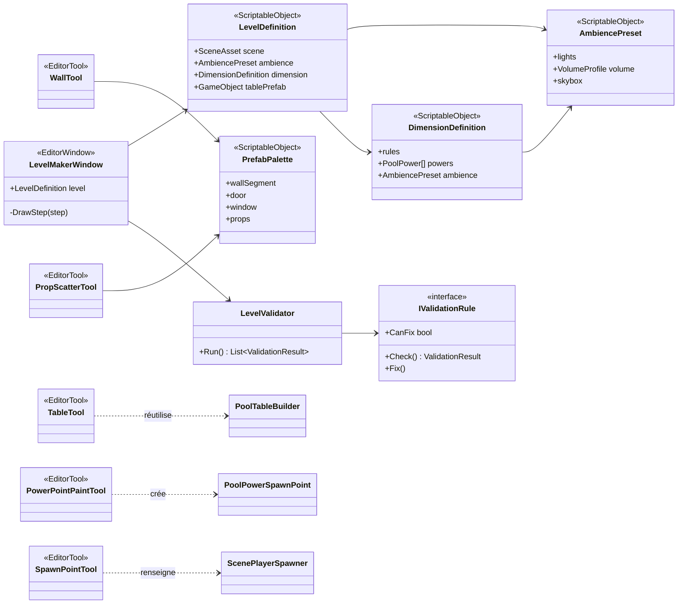
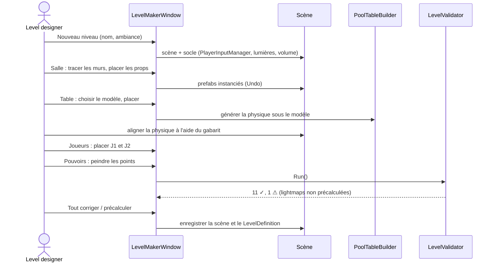

# Outil de création de niveau

> **Statut : cahier des charges, rien d'implémenté.** Décidé (TODO, 28/09) : un créateur de niveau « outil simplifié ». Ce qui reste à trancher est listé en fin de page (*Questions ouvertes*).

## 1. Objectif

Monter une **salle jouable** — décor, table, points d'apparition, pouvoirs, ambiance — en quelques minutes, sans câblage manuel ni étape oubliée, puis servir de base aux **dimensions** (une salle + ses règles + ses pouvoirs + son ambiance).

Ce que l'outil doit éviter, d'après l'historique du projet :

- les blocs « **Reste à faire dans l'éditeur** » de la TODO, faciles à oublier (assets de config, système de pouvoirs à ajouter à la table, prefabs de caisses…) ;
- les **références assignées à la main** sur le joueur et la scène (idée du 25/09 : les récupérer automatiquement) ;
- les régénérations destructives : relancer *Attach Physics To Custom Table* efface l'alignement fait à la main ;
- les erreurs de scène qui ont coûté cher : joueur posé en double dans la scène, échelle ×100, couches physiques manquantes.

## 2. La référence : BMT Building Maker Toolset

[BMT](https://assetstore.unity.com/packages/tools/level-design/bmt-building-maker-toolset-196321) est une extension d'éditeur Unity qui remplace le placement de prefabs un par un par un flux dédié :

- **murs, clôtures, tuyaux et câbles posés d'un clic** le long d'un tracé, à partir de n'importe quel kit modulaire ;
- **sols et toits** générés à partir d'un contour (*FootPrintMaker*, *PlatformShaper*) ;
- placement de **décor de détail** (câbles, tuyaux, props) ;
- fourni avec environ 200 prefabs ; compatible Built-in, URP et HDRP.

Sources : [page Asset Store](https://assetstore.unity.com/packages/tools/level-design/bmt-building-maker-toolset-196321) · [présentation sur les forums Unity](https://discussions.unity.com/t/bmt-building-maker-toolset-create-interesting-buildings-in-minutes/848576/3).

Ce qu'on en retient : **tracer plutôt que placer**, **un kit modulaire interchangeable**, **tout dans l'éditeur**. Ce qu'on ajoute : ce qui est propre à notre jeu (table, joueurs, pouvoirs, vérification de jouabilité, dimensions).

## 3. Ce qui existe déjà

| Existant | Rôle | Réutilisé par l'outil |
|---|---|---|
| `PoolTableBuilder` — *Build Table*, *Attach Physics To Custom Table* | Génère table, billes, poches, queues, points de pouvoir | Étape « Table » |
| `PoolTableAssetSettings` | Dimensions de la table, prefab de table personnalisé | Réglages de la table |
| *Add Power Spawn System To Selected Table* | Ajoute sans rien détruire le système de pouvoirs | Étape « Pouvoirs » |
| *Ensure Config Assets Exist* | Crée les ScriptableObjects de réglages manquants | Vérification |
| `ScenePlayerSpawner` | Points d'apparition des joueurs | Étape « Joueurs » |
| `PhysicsLayerSetup` | Couches ignorées par les billes | Vérification des couches |

## 4. Proposition : « Pool Level Maker »

### Principes

- **Éditeur Unity d'abord** (recommandé) : c'est là que les niveaux sont montés aujourd'hui ; un éditeur en jeu demanderait de sauvegarder les niveaux en données et une interface complète — à envisager une fois le format stable.
- **Non destructif** : tout passe par *Undo* ; rien de ce qui a été aligné à la main n'est régénéré sans le demander.
- **Aide visuelle, pas d'alignement automatique** de la physique sur un modèle de table (tenté puis écarté : trop de façons de se tromper sur un modèle quelconque).
- **Données dans des ScriptableObjects**, comme le reste du projet.
- **Plugins intacts** : l'outil ne modifie aucun fichier de plugin.

### La fenêtre

Une fenêtre **Tools > Pool > Level Maker**, organisée en étapes, avec des outils de scène (poignées, aperçus) actifs selon l'étape :

```text
┌─ Pool Level Maker ─────────────────────────────────────────┐
│ Niveau : [ Bar du port        ▼]  [Nouveau] [Dupliquer]    │
│ Ambiance : [ Bar néon ▼]   Dimension : [ Aucune ▼]         │
├────────────────────────────────────────────────────────────┤
│ ① Salle     ② Table     ③ Joueurs    ④ Pouvoirs   ⑤ Vérif. │
├────────────────────────────────────────────────────────────┤
│ ② Table                                                    │
│  Modèle : [ ClassicPoolTable ▼ ]   Échelle : 1 ✓           │
│  [Placer dans la scène]  (aimanté au sol, rotation 90°)    │
│  Physique : ✓ générée   ⚠ à aligner sur le tapis           │
│  [Afficher le gabarit du tapis]  [Régénérer…]              │
├────────────────────────────────────────────────────────────┤
│ ⑤ Vérification : 11 ✓   1 ⚠   0 ✗        [Tout corriger]   │
└────────────────────────────────────────────────────────────┘
```

### Étape 1 — une scène jouable (MVP)

| Fonction | Détail |
|---|---|
| **Nouveau niveau** | Scène vierge avec le socle commun : `PlayerInputManager` configuré (prefab joueur, écran partagé, 2 joueurs max), lumière et volume de post-process de l'ambiance choisie |
| **Table** | Choix du prefab de table, placement aimanté au sol, physique générée (réutilise `PoolTableBuilder`), **gabarit du tapis affiché** pour aligner la physique à l'œil, échelle vérifiée |
| **Joueurs** | Deux poignées J1 / J2 dans la scène, écrites dans `ScenePlayerSpawner` ; alerte si un point est dans la table |
| **Pouvoirs** | Points de caisse **peints au clic** sur le tapis (ou grille avec variation, comme aujourd'hui) ; aperçu du rayon de ramassage ; ajout des gestionnaires |
| **Vérification** | Liste de contrôles (section 6), chacun avec un bouton « Corriger » quand c'est possible |
| **Références automatiques** | Les champs du joueur qui pointent vers la scène (caméra, table…) sont retrouvés au lancement ; ceux du prefab lui-même sont vérifiés dans l'éditeur |

### Étape 2 — construire la salle (façon BMT)

| Fonction | Détail |
|---|---|
| **Grille et aimantation** | Pas réglable (0,25 / 0,5 / 1 m), rotation par 90° |
| **Murs par tracé** | Clic, clic, clic : un segment de mur modulaire par pas de grille, angles gérés ; clic sur un segment pour le remplacer par une porte ou une fenêtre |
| **Sol et plafond** | Générés à partir du contour des murs |
| **Chemins de décor** | Guirlandes, néons, câbles le long d'une courbe — le package **Splines** (déjà installé) sait répartir des objets sur une courbe |
| **Palette de props** | Bar, tabourets, lampes, bouteilles… placés au clic sur les surfaces, avec rotation et échelle aléatoires optionnelles |
| **Kit modulaire** | Une « palette » (ScriptableObject) par style de salle : même outil, décor différent |
| **Ambiance** | Préréglage (lumières, volume, fond) appliqué d'un clic ; bouton pour précalculer l'éclairage (lightmaps) |

### Étape 3 — dimensions

| Fonction | Détail |
|---|---|
| **Définition de dimension** | ScriptableObject : ambiance, règles ou modificateurs, pouvoirs disponibles, musique |
| **Niveaux enregistrés** | Liste des niveaux avec vignette, dupliquer un niveau pour en faire une variante |
| **Éditeur en jeu** | Plus tard, si le besoin se confirme : réutiliserait les mêmes données |

## 5. Architecture technique

### Briques Unity utilisées

| Besoin | API Unity |
|---|---|
| Fenêtre | `EditorWindow` (ou UI Toolkit) |
| Outils dans la vue Scène | `EditorTool` + `Handles` (poignées, aperçus) et `Overlay` (petits panneaux dans la vue Scène) |
| Placer des prefabs en gardant le lien au prefab | `PrefabUtility.InstantiatePrefab` |
| Annuler / rétablir | `Undo.RegisterCreatedObjectUndo`, `Undo.RecordObject` |
| Aimantation | Grille de l'éditeur (`EditorSnapSettings`) ou arrondi maison |
| Viser une surface | `HandleUtility.GUIPointToWorldRay` + `Physics.Raycast` |
| Répartir sur une courbe | Package Splines (`SplineInstantiate`) |
| Éclairage précalculé | `Lightmapping.BakeAsync` |
| Données | ScriptableObjects (`AssetDatabase`) |

### Classes proposées



### Créer un niveau



## 6. Vérifications

| Contrôle | Correction proposée |
|---|---|
| Une seule table (`PoolMatchRules`, `PoolTableSurface`) | — (signalé) |
| 6 poches, 16 billes dont 1 blanche, `PowerBall` sur les billes de couleur | Ajouter ce qui manque |
| Échelle de la physique de table = 1 | Remettre à 1 |
| 2 queues avec `LocalGrabbable`, `Cue`, `InteractionObject`, `InteractionTrigger` | Signalé, avec la liste des composants manquants |
| `PlayerInputManager` : prefab joueur, écran partagé, 2 joueurs max | Régler |
| `ScenePlayerSpawner` avec 2 points hors de la table | Créer les points |
| Aucun joueur posé directement dans la scène | Proposer de le retirer |
| Système de pouvoirs présent (points, `PoolPowerCrateManager`, `PoolPowerBallRotator`) | *Add Power Spawn System* |
| Fichiers de configuration présents dans `Resources` | *Ensure Config Assets Exist* |
| Couches `Poolball`, `PlayerAnimated`, `Ragdoll`, `Cuestick` existent | Signalé (à créer dans Tags & Layers) |
| Éclairage précalculé à jour | Lancer le précalcul |

## 7. Alternatives

| Option | Pour | Contre |
|---|---|---|
| **Outil maison** (cette page) | Fait exactement ce que le jeu demande (table, joueurs, pouvoirs, vérifications) | Temps de développement |
| **Acheter BMT** | Tracé de murs et décor prêts, 200 prefabs | Ne connaît ni la table ni les règles ; un plugin de plus à ne pas modifier |
| **ProBuilder** (package Unity gratuit) | Maquetter une salle (murs, sols) directement dans l'éditeur | Pas de kit modulaire ni de logique de jeu |
| **À la main + vérification seule** | Le plus rapide à faire : juste l'étape ⑤ | Ne fait pas gagner de temps de construction |

**Recommandation** : commencer par l'étape 1 (scène jouable + vérifications), qui règle les problèmes rencontrés jusqu'ici ; décider ensuite entre l'étape 2 maison, BMT ou ProBuilder pour la construction des salles.

## 8. Questions ouvertes

1. **Éditeur ou en jeu ?** Recommandation : éditeur d'abord.
2. **Qui construit les salles** : toi seul, ou d'autres personnes (niveau de simplicité attendu) ?
3. **Kit modulaire** : existe-t-il déjà (Forest Bar ?), ou faut-il en choisir un ?
4. **Dimensions** : une scène par dimension, ou une scène qui charge des ambiances et des règles différentes ?
5. **Priorité** par rapport à la refonte de l'interface et au reste de la TODO.

## 9. Découpage proposé

| Lot | Contenu | Taille |
|---|---|---|
| 1 | Vérifications + corrections (étape ⑤) | Petit |
| 2 | Fenêtre + nouveau niveau + table + joueurs + pouvoirs | Moyen |
| 3 | Références automatiques du joueur | Petit |
| 4 | Grille, murs par tracé, palette de props | Grand |
| 5 | Ambiances et précalcul de l'éclairage | Moyen |
| 6 | Dimensions | Moyen, dépend du système de dimensions |
