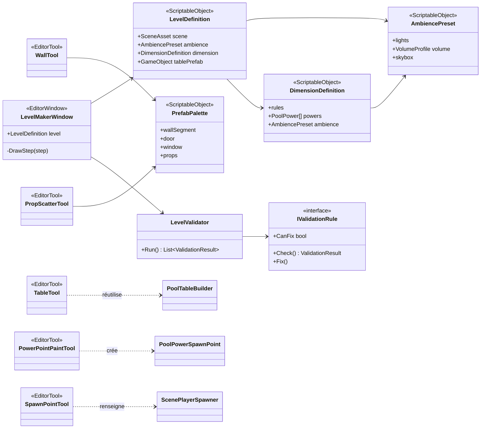
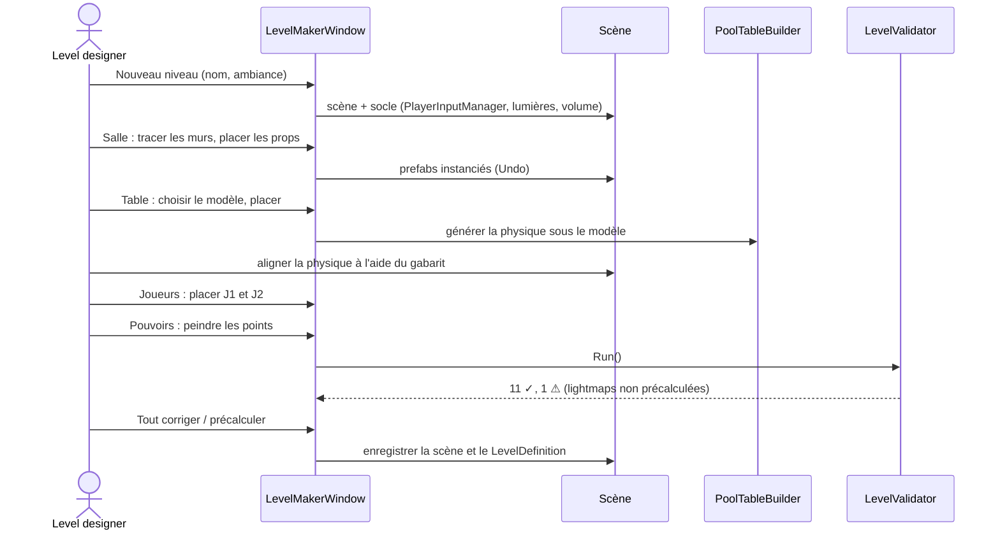

# Outil de création de niveau

> **Statut : lots 1, 2 et 3 faits et validés (01/10) ; lot 4 fait et validé (chemins de décor reportés)** — fenêtre **Tools > Pool > Level Maker**, voir *Ce qui est fait* ci-dessous. Décisions du 01/10 en fin de page.

## Ce qui est fait (lots 1, 2 et 4)

| Étape | Contenu |
|---|---|
| ① Niveau | **Créer le niveau** : scène neuve avec lumière, volume global, sol provisoire 20 × 20 m, PlayerInputManager (prefab joueur, écran partagé, 2 joueurs max), `ScenePlayerSpawner` et deux points d'apparition ; enregistrée dans `Assets/Scenes/Levels`, ajoutée au build. **Compléter le socle** fait la même chose sur la scène ouverte sans rien recréer. Réglages de l'outil affichés en dessous. |
| ② Salle (lot 4) | **Palette** de kit (greybox généré ou Forest Bar, ou toute palette créée par *Nouvelle palette…* ou *Create > Pool > Level Maker Palette*). **Remplir depuis un dossier…** range tous les prefabs d'un pack dans la palette : par nom (wall/mur, door/porte, window/fenêtre, floor/sol, ceiling/roof/plafond, pillar/column/poteau), puis par forme mesurée ; les pièces de mur d'une autre largeur que le module partent en props, effets et decals sont ignorés, les prefabs roses (matériaux d'un autre pipeline) sont signalés ; **grille** (pas, hauteur du sol). Chaque type de pièce a ses **variantes** (listes de la palette) : chaque outil les affiche en vignettes, la sélectionnée est celle utilisée, et la salle retient l'index de ses variantes. Outils de la vue Scène : **Murs** (variantes de mur et de poteau ; la largeur du mur choisi donne le pas du tracé, et le sol et le plafond les plus proches de cette largeur sont choisis avec lui) — clic par point, aimanté à la grille, angles par 45° (Maj = libre), longueurs en modules entiers ; clic sur le premier point = salle fermée (avec son sol ; un coin est ajouté si besoin pour que chaque côté reste un nombre entier de murs, fermeture refusée si c'est impossible) ; case « Sol seul » pour tracer une zone de sol libre sans murs, aimantée sur la taille de la dalle ; une salle tracée dans une autre (pièce dans une pièce) n'a pas de sol propre et ne double pas les murs existants, Entrée = tracé ouvert, Retour arrière = annuler un point. **Ouvertures** — clic sur un module : porte, fenêtre ou mur, de la variante choisie (une pièce plus large qu'un mur prend la place des murs voisins nécessaires) ; option « Imbriquer » pour poser la pièce dans le module existant (porte de cage dans son cadre). **Sol / plafond** — clic sur une salle fermée : lui applique les variantes de sol et de plafond choisies ; une dalle proche de la largeur du mur est ajustée à une case (*Fit Tiles To Module*, *Tile Fit Tolerance*), les autres gardent leur taille et débordent sous les murs. **Props** — vignettes de la palette, clic sur une surface, rotation aléatoire ou fixe (R : +45°), échelle aléatoire, option « suivre la pente / le mur », Maj + clic = retirer. **Liste des salles** : variantes de mur, poteau, sol et plafond ; palette (reconstruit la salle dans l'autre kit en gardant portes et fenêtres), sol, plafond, retourner les murs, reconstruire, supprimer. |
| ③ Table | **Placer** le modèle au centre de la vue Scène, posé au sol ; rotation par 90° ; **Poser au sol**. **Générer la physique** si le modèle n'a pas de `PoolMatchRules` (même échafaudage que *Attach Physics*, sans les queues-cylindres). **Gabarit du tapis** : aire de jeu (jaune), bandes (orange), poches (rouge) dessinées dans la vue Scène pour aligner `PoolPhysics` à l'œil. **Placer les queues manquantes** (prefab `Cue`) au bout de la table. |
| ④ Joueurs | Configurer le PlayerInputManager ; créer les points J1/J2 de part et d'autre de la table ; dans la vue Scène, silhouette de joueur par point avec flèches (déplacer), cercle (orienter), collage au sol, rouge si dans la table. |
| ⑤ Pouvoirs | Ajouter le système de pouvoirs à la table ; **pinceau** : clic sur une surface = un point de caisse (rangé sous la table si on clique dessus, sinon sous « PowerSpawnPoints (salle) »), Maj + clic = retirer le plus proche, Échap = arrêter. |
| ⑥ Ambiance (lot 5) | **Projet** : activer APV et les scénarios d'éclairage dans les assets URP. **Préparer la scène** : contrôleur d'ambiance, volume de sondes global, réglages d'éclairage (indirect seulement), baking set avec un scénario par ambiance. **Ambiances** (`AmbiencePreset` : ciel et lumière ambiante, lumière principale, post-process et brouillard, teinte des lumières du décor) : appliquer, précalculer une ambiance ou toutes à la suite ; ambiances de départ Bar néon, Prison sombre, Jour neutre. En jeu, `AmbienceController.Apply` / `BlendTo` change d'ambiance (le scénario d'éclairage précalculé suit). |
| ⑦ Vérification | Contrôles de la section 6, chacun avec **Voir** et **Corriger** quand la correction est sûre ; **Tout corriger** (sauf retirer un joueur posé, laissé manuel). Résumé ✓ / ⚠ / ✗ en bas de chaque étape, mis à jour à chaque changement de la scène. |

**Étages** (écrit, non testé) : « Étage actif » dans l'étape Salle — le tracé se fait à la hauteur de cet étage (un étage = la hauteur des murs du kit), la salle retient son étage. Outil **Escaliers** : clic sur le sol d'une salle fermée (R pour tourner, Maj + clic pour retirer) ; l'escalier est étiré à la hauteur d'un étage, perce le sol de la salle au-dessus et reçoit une rampe invisible pour que le personnage monte sans buter. Pas de plafond sous une salle d'étage. Ouvertures **Garde-corps** et **Vide** ; une salle peut avoir un vide dans son sol (mezzanine) bordé de garde-corps. Palette : listes *Stairs* et *Railings*.

**Génération procédurale** : une première version (plan de salles, thèmes et types de pièce) a été retirée le 01/10, résultat pas assez cohérent. À refaire plus tard sur le modèle de RoomGen et de Procedural Generation Grid : voir l'onglet Pistes.

**Lot 3 — références automatiques** : la scène n'a plus rien à câbler sur le joueur. Table, règles et queues sont trouvées au lancement. Ce que le joueur posé dans BarSplitscreen recevait à la main, à savoir les lignes d'aperçu de trajectoire, est retrouvé parmi les enfants du joueur ou créé. Le reste qui pouvait être vide est retrouvé ou créé de la même façon : cible du regard en visée, Look At IK, caméras. Ce que le joueur ne peut pas trouver seul (ses propres composants) est contrôlé par la vérification « Prefab joueur ».

Réglages de l'outil : `Assets/Editor/LevelMakerSettings.asset` (prefab joueur, modèle de table, prefab de queue, dossier des niveaux, profil de volume, sol provisoire, nombre de queues, pas de rotation), rempli automatiquement à la première ouverture. Code : `Assets/Scripts/Editor/LevelMaker/` (`LevelMakerWindow` et `LevelMakerWindow.Room`, `LevelBuilder`, `LevelValidator`, `LevelMakerSettings`, `RoomBuilder`, `KitGenerator`) ; données posées dans les scènes : `Assets/Scripts/Core/Level/` (`PrefabPalette`, `RoomOutline`, `RoomModule`). Kits : `Assets/LevelKits/`.

**Principe des salles** : une salle est un tracé (`RoomOutline` : points, ouvertures, sol, plafond) ; les modules sont ses enfants et se reconstruisent à partir de lui. Chaque pièce est placée d'après ses dimensions mesurées (centrée sur sa case, base au sol), pas d'après son pivot, ce qui permet de passer d'un kit à l'autre. La largeur d'une case est celle de la variante de mur de la salle. L'axe le long duquel court un module de mur est déduit de sa forme (*Wall Axis* = Auto : le plus long de ses côtés horizontaux), forçable à X ou Z sur la palette ; *Flip Walls* si la face intérieure du kit est de l'autre côté.

## 1. Objectif

Monter une **salle jouable** — décor, table, points d'apparition, pouvoirs, ambiance — en quelques minutes, sans câblage manuel ni étape oubliée, puis servir de base aux **dimensions** (une salle + ses règles + ses pouvoirs + son ambiance).

Ce que l'outil doit éviter, d'après l'historique du projet :

- les blocs « **Reste à faire dans l'éditeur** » de la TODO, faciles à oublier (assets de config, système de pouvoirs à ajouter à la table, prefabs de caisses…) ;
- les **références assignées à la main** sur le joueur et la scène (idée du 25/09 : les récupérer automatiquement) ;
- les régénérations destructives : relancer *Attach Physics To Custom Table* efface l'alignement fait à la main ;
- les erreurs de scène qui ont coûté cher : joueur posé en double dans la scène, échelle ×100, couches physiques manquantes.

## 2. La référence : BMT Building Maker Toolset

[BMT](https://assetstore.unity.com/packages/tools/level-design/bmt-building-maker-toolset-196321) est une extension d'éditeur Unity qui remplace le placement de prefabs un par un par un flux dédié :

- **murs, clôtures, tuyaux et câbles posés d'un clic** le long d'un tracé, à partir de n'importe quel kit modulaire ;
- **sols et toits** générés à partir d'un contour (*FootPrintMaker*, *PlatformShaper*) ;
- placement de **décor de détail** (câbles, tuyaux, props) ;
- fourni avec environ 200 prefabs ; compatible Built-in, URP et HDRP.

Sources : [page Asset Store](https://assetstore.unity.com/packages/tools/level-design/bmt-building-maker-toolset-196321) · [présentation sur les forums Unity](https://discussions.unity.com/t/bmt-building-maker-toolset-create-interesting-buildings-in-minutes/848576/3).

Ce qu'on en retient : **tracer plutôt que placer**, **un kit modulaire interchangeable**, **tout dans l'éditeur**. Ce qu'on ajoute : ce qui est propre à notre jeu (table, joueurs, pouvoirs, vérification de jouabilité, dimensions).

## 3. Ce qui existe déjà

| Existant | Rôle | Réutilisé par l'outil |
|---|---|---|
| `PoolTableBuilder` — *Build Table*, *Attach Physics To Custom Table* | Génère table, billes, poches, queues, points de pouvoir | Étape « Table » |
| `PoolTableAssetSettings` | Dimensions de la table, prefab de table personnalisé | Réglages de la table |
| *Add Power Spawn System To Selected Table* | Ajoute sans rien détruire le système de pouvoirs | Étape « Pouvoirs » |
| *Ensure Config Assets Exist* | Crée les ScriptableObjects de réglages manquants | Vérification |
| `ScenePlayerSpawner` | Points d'apparition des joueurs | Étape « Joueurs » |
| `PhysicsLayerSetup` | Couches ignorées par les billes | Vérification des couches |

## 4. Proposition : « Pool Level Maker »

### Principes

- **Éditeur Unity d'abord** (recommandé) : c'est là que les niveaux sont montés aujourd'hui ; un éditeur en jeu demanderait de sauvegarder les niveaux en données et une interface complète — à envisager une fois le format stable.
- **Non destructif** : tout passe par *Undo* ; rien de ce qui a été aligné à la main n'est régénéré sans le demander.
- **Aide visuelle, pas d'alignement automatique** de la physique sur un modèle de table (tenté puis écarté : trop de façons de se tromper sur un modèle quelconque).
- **Données dans des ScriptableObjects**, comme le reste du projet.
- **Plugins intacts** : l'outil ne modifie aucun fichier de plugin.

### La fenêtre

Une fenêtre **Tools > Pool > Level Maker**, organisée en étapes, avec des outils de scène (poignées, aperçus) actifs selon l'étape :

```text
┌─ Pool Level Maker ─────────────────────────────────────────┐
│ Niveau : [ Bar du port        ▼]  [Nouveau] [Dupliquer]    │
│ Ambiance : [ Bar néon ▼]   Dimension : [ Aucune ▼]         │
├────────────────────────────────────────────────────────────┤
│ ① Salle     ② Table     ③ Joueurs    ④ Pouvoirs   ⑤ Vérif. │
├────────────────────────────────────────────────────────────┤
│ ② Table                                                    │
│  Modèle : [ ClassicPoolTable ▼ ]   Échelle : 1 ✓           │
│  [Placer dans la scène]  (aimanté au sol, rotation 90°)    │
│  Physique : ✓ générée   ⚠ à aligner sur le tapis           │
│  [Afficher le gabarit du tapis]  [Régénérer…]              │
├────────────────────────────────────────────────────────────┤
│ ⑤ Vérification : 11 ✓   1 ⚠   0 ✗        [Tout corriger]   │
└────────────────────────────────────────────────────────────┘
```

### Étape 1 — une scène jouable (MVP)

| Fonction | Détail |
|---|---|
| **Nouveau niveau** | Scène vierge avec le socle commun : `PlayerInputManager` configuré (prefab joueur, écran partagé, 2 joueurs max), lumière et volume de post-process de l'ambiance choisie |
| **Table** | Choix du prefab de table, placement aimanté au sol, physique générée (réutilise `PoolTableBuilder`), **gabarit du tapis affiché** pour aligner la physique à l'œil, échelle vérifiée |
| **Joueurs** | Deux poignées J1 / J2 dans la scène, écrites dans `ScenePlayerSpawner` ; alerte si un point est dans la table |
| **Pouvoirs** | Points de caisse **peints au clic** sur le tapis (ou grille avec variation, comme aujourd'hui) ; aperçu du rayon de ramassage ; ajout des gestionnaires |
| **Vérification** | Liste de contrôles (section 6), chacun avec un bouton « Corriger » quand c'est possible |
| **Références automatiques** | Les champs du joueur qui pointent vers la scène (caméra, table…) sont retrouvés au lancement ; ceux du prefab lui-même sont vérifiés dans l'éditeur |

### Étape 2 — construire la salle (façon BMT)

| Fonction | Détail |
|---|---|
| **Grille et aimantation** | Pas réglable (0,25 / 0,5 / 1 m), rotation par 90° |
| **Murs par tracé** | Clic, clic, clic : un segment de mur modulaire par pas de grille, angles gérés ; clic sur un segment pour le remplacer par une porte ou une fenêtre |
| **Sol et plafond** | Générés à partir du contour des murs |
| **Chemins de décor** | Guirlandes, néons, câbles le long d'une courbe — le package **Splines** (déjà installé) sait répartir des objets sur une courbe |
| **Palette de props** | Bar, tabourets, lampes, bouteilles… placés au clic sur les surfaces, avec rotation et échelle aléatoires optionnelles |
| **Kit modulaire** | Une « palette » (ScriptableObject) par style de salle : même outil, décor différent |
| **Ambiance** | Préréglage (lumières, volume, fond) appliqué d'un clic ; bouton pour précalculer l'éclairage (lightmaps) |

### Étape 3 — dimensions

| Fonction | Détail |
|---|---|
| **Définition de dimension** | ScriptableObject : ambiance, règles ou modificateurs, pouvoirs disponibles, musique |
| **Niveaux enregistrés** | Liste des niveaux avec vignette, dupliquer un niveau pour en faire une variante |
| **Éditeur en jeu** | Plus tard, si le besoin se confirme : réutiliserait les mêmes données |

## 5. Architecture technique

### Briques Unity utilisées

| Besoin | API Unity |
|---|---|
| Fenêtre | `EditorWindow` (ou UI Toolkit) |
| Outils dans la vue Scène | `EditorTool` + `Handles` (poignées, aperçus) et `Overlay` (petits panneaux dans la vue Scène) |
| Placer des prefabs en gardant le lien au prefab | `PrefabUtility.InstantiatePrefab` |
| Annuler / rétablir | `Undo.RegisterCreatedObjectUndo`, `Undo.RecordObject` |
| Aimantation | Grille de l'éditeur (`EditorSnapSettings`) ou arrondi maison |
| Viser une surface | `HandleUtility.GUIPointToWorldRay` + `Physics.Raycast` |
| Répartir sur une courbe | Package Splines (`SplineInstantiate`) |
| Éclairage précalculé | `Lightmapping.BakeAsync` |
| Données | ScriptableObjects (`AssetDatabase`) |

### Classes proposées



### Créer un niveau



## 6. Vérifications

| Contrôle | Correction proposée |
|---|---|
| Une seule table (`PoolMatchRules`, `PoolTableSurface`) | — (signalé) |
| 6 poches, 16 billes dont 1 blanche, `PowerBall` sur les billes de couleur | Ajouter ce qui manque |
| Échelle de la physique de table = 1 | Remettre à 1 |
| 2 queues avec `LocalGrabbable`, `Cue`, `InteractionObject`, `InteractionTrigger` | Signalé, avec la liste des composants manquants |
| `PlayerInputManager` : prefab joueur, écran partagé, 2 joueurs max | Régler |
| `ScenePlayerSpawner` avec 2 points hors de la table | Créer les points |
| Aucun joueur posé directement dans la scène | Proposer de le retirer |
| Système de pouvoirs présent (points, `PoolPowerCrateManager`, `PoolPowerBallRotator`) | *Add Power Spawn System* |
| Fichiers de configuration présents dans `Resources` | *Ensure Config Assets Exist* |
| Couches `Poolball`, `PlayerAnimated`, `Ragdoll`, `Cuestick` existent | Signalé (à créer dans Tags & Layers) |
| Éclairage précalculé à jour | Lancer le précalcul |

## 7. Alternatives

| Option | Pour | Contre |
|---|---|---|
| **Outil maison** (cette page) | Fait exactement ce que le jeu demande (table, joueurs, pouvoirs, vérifications) | Temps de développement |
| **Acheter BMT** | Tracé de murs et décor prêts, 200 prefabs | Ne connaît ni la table ni les règles ; un plugin de plus à ne pas modifier |
| **ProBuilder** (package Unity gratuit) | Maquetter une salle (murs, sols) directement dans l'éditeur | Pas de kit modulaire ni de logique de jeu |
| **À la main + vérification seule** | Le plus rapide à faire : juste l'étape ⑤ | Ne fait pas gagner de temps de construction |

**Recommandation** : commencer par l'étape 1 (scène jouable + vérifications), qui règle les problèmes rencontrés jusqu'ici ; décider ensuite entre l'étape 2 maison, BMT ou ProBuilder pour la construction des salles.

## 8. Décisions (01/10)

1. **Éditeur ou en jeu ?** Éditeur Unity.
2. **Qui construit les salles** : l'utilisateur seul — outil pragmatique, appuyé sur les outils Unity standards.
3. **Kit modulaire** : à choisir plus tard ; le lot 4 partira d'une palette vide à remplir.
4. **Dimensions** : une même salle pourra recevoir plusieurs ambiances et règles, chargées au lancement (pas une scène par dimension).
5. **Priorité** : lots 1 et 2 d'abord.

## 9. Découpage proposé

| Lot | Contenu | Taille |
|---|---|---|
| 1 | Vérifications + corrections (étape ⑤) | Petit |
| 2 | Fenêtre + nouveau niveau + table + joueurs + pouvoirs | Moyen |
| 3 | Références automatiques du joueur | Petit |
| 4 | Grille, murs par tracé, palette de props | Grand |
| 5 | Ambiances et précalcul de l'éclairage | Moyen |
| 6 | Dimensions | Moyen, dépend du système de dimensions |
