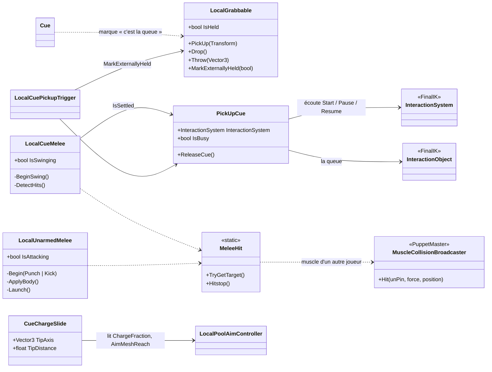
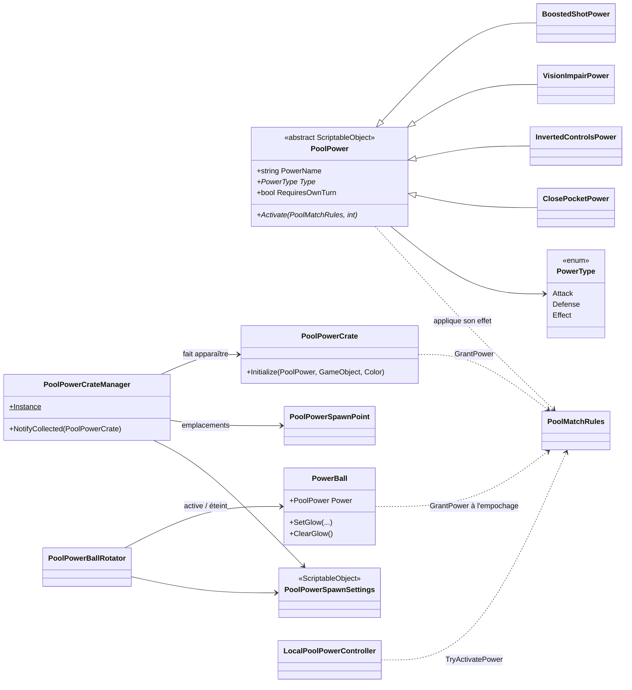

# Architecture et diagrammes de classes

> État du code au 29/09/2026 (`Assets/Scripts`). Seuls les scripts `Local*` sont maintenus ; les scripts online (`FpsPlayerController`, `PlayerHandController`, `Grabbable`, `PoolAimController`, `CharacterAnimationController`, `PoolPowerController`) sont conservés mais figés et n'apparaissent pas ici.

## Vue d'ensemble

Le code est découpé en quatre espaces de noms (namespaces) :

| Namespace | Rôle | Scripts principaux |
|---|---|---|
| `UntitledPoolGame.Player` | Déplacement, caméra, animation, ragdoll du joueur | `LocalFpsPlayerController`, `LocalCharacterAnimationController`, `LocalPlayerRagdollController`, `RagdollHitRelay`, `LocalCharacterModelFollow` |
| `UntitledPoolGame.Interaction` | Ramasser, porter, lancer ; la queue ; les coups (queue, poing, pied) | `LocalPlayerHandController`, `LocalGrabbable`, `Cue`, `LocalCuePickupTrigger`, `PickUpCue`, `CueChargeSlide`, `LocalCueMelee`, `LocalUnarmedMelee`, `MeleeHit` |
| `UntitledPoolGame.Pool` | Billard : billes, table, règles, visée, pouvoirs, réglages | `PoolBall`, `PoolPocket`, `PoolTableSurface`, `PoolMatchRules`, `IPoolRuleSet` et ses règles, `LocalPoolAimController`, `PoolPower` et ses pouvoirs, config ScriptableObjects |
| `UntitledPoolGame.Core` | Outils transverses et triches de test | `PhysicsLayerSetup`, `SplitScreenCheatSpawner`, `EightBallEndgameCheat`, `RagdollDummySpawner`, `ScenePlayerSpawner`, `NetworkBootstrap` |

Un outil d'éditeur, `PoolTableBuilder` (namespace `UntitledPoolGame.PoolEditor`), génère la table, les billes, les poches, les queues et les points d'apparition des pouvoirs. Le **Level Maker** (`LevelMakerWindow`, même namespace, Tools > Pool > Level Maker) monte un niveau jouable par étapes en s'appuyant dessus (`AttachPhysicsTo`, `AddPowerSpawnSystemTo`) et vérifie la scène (`LevelValidator`) ; voir la page [Outil de niveau](level.html).

### Principes

- **Un composant = une responsabilité** : le joueur est un assemblage de composants (`LocalFpsPlayerController` pour bouger, `LocalPlayerHandController` pour tenir, `LocalPoolAimController` pour viser…) qui se désactivent entre eux selon l'état (visée, ragdoll).
- **Singletons de scène** pour ce qui est unique : `PoolMatchRules.Instance`, `PoolTableSurface.Instance`, `PoolPowerCrateManager.Instance`.
- **Registres statiques** plutôt que des recherches coûteuses : `PoolBall.Active`, `PoolPocket.Active`.
- **Événements statiques** pour découpler : `PoolBall.Pocketed`, `PoolBall.CueBallFirstContact`, `PoolMatchRules.Fouled`, `PoolMatchRules.PowerGranted`.
- **Données dans des ScriptableObjects** : réglages (physique, effets, pouvoirs) et chaque pouvoir est un asset (voir *Configuration → rendu*).
- **Stratégie pour les règles** : `PoolMatchRules` délègue la résolution d'un tir à une implémentation de `IPoolRuleSet` choisie au lancement de la partie.

## Joueur

Tous ces composants sont sur la racine du prefab joueur. `PlayerInput` (Input System) fournit à chacun les actions de **ce** joueur : c'est ce qui permet deux joueurs sur le même PC.

## Queue et objets tenus

- Les objets ordinaires passent par `LocalObjectHands` (ajouté automatiquement au joueur) : la main droite va chercher l'objet, un objet léger est attaché à la main droite et lancé par-dessus l'épaule, un objet lourd est tenu à deux mains et lancé depuis au-dessus de la tête ; l'objet quitte la main en cours de geste (`LocalGrabbable.ReleaseFromHand`). Composant désactivé : ancien chemin `LocalGrabbable.PickUp/Drop/Throw` (objet collé devant le joueur).
- **Nouvelle prise procédurale (en test)** : `LocalCueHolder`, sur le joueur, prend la main sur la queue tant qu'il est présent et actif (le décocher = retour à l'ancienne prise ci-dessous, intacte). Les queues n'ont pas de propriétaire : chaque `Cue` s'inscrit dans `Cue.All` tant qu'elle est active (placée dans le niveau ou apparue en cours de partie) et expose ce qu'il faut pour la prendre (objet ramassable, glissement, prises des deux mains). On peut ramasser à tout moment, seul le tir dépend du tour. Il cherche la queue libre à portée que le joueur regarde, calcule deux prises autour du point de la queue le plus proche d'un point confortable devant la poitrine (main droite à droite), oriente les mains à partir des cibles de port de la queue (ses `InteractionTarget`), plie les genoux (pieds épinglés, effecteur du corps abaissé), puis amène la queue en pose de port (`PickUpCue.HoldPoint` / `CarryRotation`) en faisant glisser les mains jusqu'aux prises de port. `LocalPlayerHandController.CueBusy` / `CueSettled` exposent l'état de la prise, quel que soit le système.
- L'ancienne prise passe par **FinalIK InteractionSystem** : les mains vont chercher des cibles placées sur la queue, puis `PickUpCue` l'attache au personnage. `PickUpCue` règle aussi le poids des bend goals des bras : 0 sans la queue, fondu jusqu'à 1 quand elle est tenue (écrit seulement pendant le fondu). `LocalGrabbable` ne sert alors qu'à tenir l'état « tenu » à jour.
- `LocalCueMelee` gère le coup de queue « armer en tournant » : charge tant qu'Attaque est maintenue, direction donnée par la rotation faite pendant la charge, arc posé dans le repère de la caméra, vue ramenée vers la cible à la frappe (`LocalFpsPlayerController.AddLook`, assistance vers l'adversaire le plus proche dans un cône) ; la queue tenue pivote autour du point entre les deux prises (pour l'estoc, elle s'aligne sur le regard en position de tir puis avance le long de son axe : la pointe frappe) et les muscles des autres ragdolls touchés reçoivent `MuscleCollisionBroadcaster.Hit`.
- `LocalUnarmedMelee` gère le poing (mains vides, part au clic, sans charge) et le pied (clic bref = coup simple, maintenu = coup chargé). Les distances sont mises à l'échelle de la longueur réelle du bras / de la jambe, et la main comme le pied sont orientés (jointures, semelle vers la cible). Juste avant la résolution FBBIK, il tire l'effecteur de la main ou du pied droit vers la garde puis le long de la frappe (cibles recalculées depuis l'épaule ou la hanche animée et la caméra) : crochet en courbe de Bézier pour le poing avec le coude écarté, pied tendu semelle face à la cible avec le genou vers l'avant (bend goals FBBIK créés à l'exécution, réglages d'origine des chaînes remis ensuite). Il tourne aussi le buste, penche le corps et, pour le poing, avance l'épaule qui frappe (effecteur d'épaule). Les poings s'enchaînent : le bras précédent se relâche seul pendant que l'autre frappe. Le pied chargé (coup de pied spartiate) met la cible en ragdoll, donne une vitesse à tous ses muscles et zoome la caméra Cinemachine FPS de l'attaquant (plus de ralenti depuis le 30/09). `MeleeHit` regroupe ce qui est commun aux coups (identifier le muscle et le joueur touchés, hitstop).
- `CueChargeSlide` ne déplace que le **mesh** de la queue (recul pendant la charge, allongement quand le joueur est loin de la bille), jamais les points de prise — sinon les mains, et le corps avec, suivraient.

## Billard et règles

Le mode **Party** réutilise `EightBallRuleSet` ; ce sont les gestionnaires de pouvoirs qui ne s'activent qu'en Party.

## Pouvoirs

Ajouter un pouvoir = une nouvelle classe dérivée de `PoolPower` + un asset créé via **Create > Pool > Powers**, ajouté à `Available Powers` dans `PoolPowerSpawnSettings`.

## Dépendances à respecter

- `PoolMatchRules` ne connaît **aucun** script joueur : tout passe par des index de joueur (0/1). C'est ce qui lui permet d'être partagé par tous les modes et, plus tard, par l'online.
- Les scripts joueur lisent `PoolMatchRules.Instance` et tolèrent son absence (scène sans table).
- `GetEffectivePlayerIndex` traduit l'index physique d'un `PlayerInput` en joueur de la partie : identique en écran partagé, ramené au joueur dont c'est le tour quand un seul joueur joue les deux côtés.
