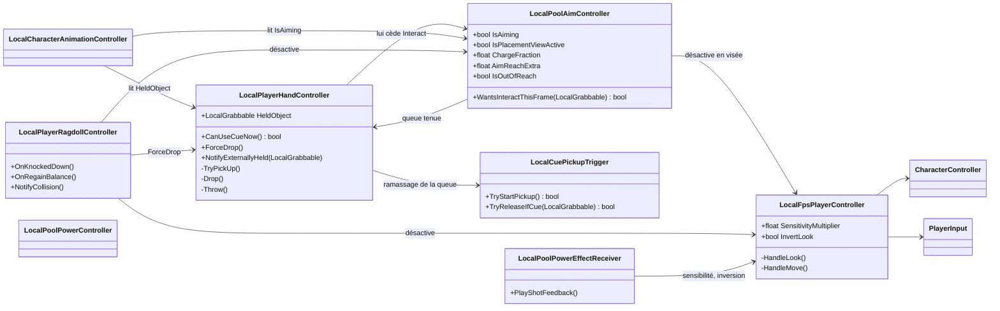
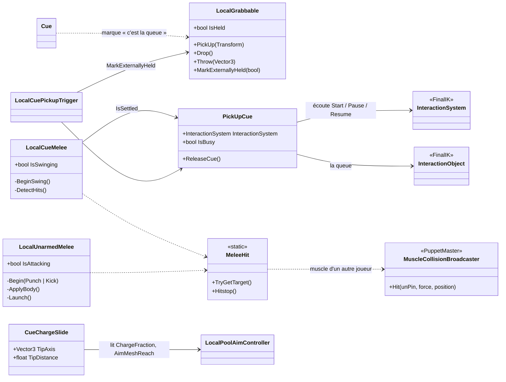
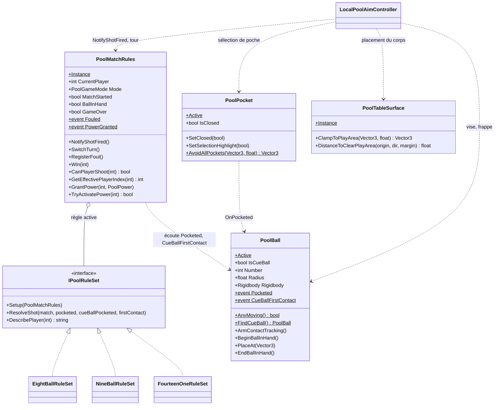
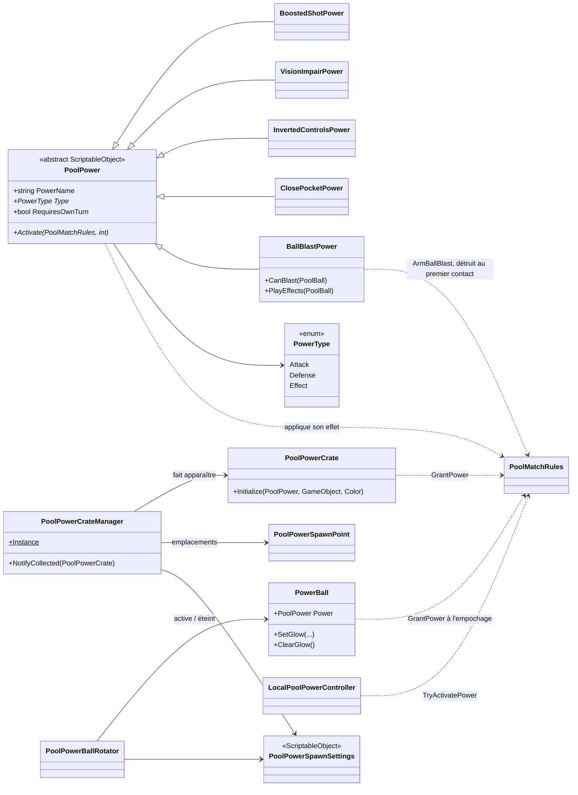

# Architecture et diagrammes de classes

> État du code au 29/09/2026 (`Assets/Scripts`). Seuls les scripts `Local*` sont maintenus ; les scripts online (`FpsPlayerController`, `PlayerHandController`, `Grabbable`, `PoolAimController`, `CharacterAnimationController`, `PoolPowerController`) sont conservés mais figés et n'apparaissent pas ici.

## Vue d'ensemble

Le code est découpé en quatre espaces de noms (namespaces) :

| Namespace | Rôle | Scripts principaux |
|---|---|---|
| `UntitledPoolGame.Player` | Déplacement, caméra, animation, ragdoll du joueur | `LocalFpsPlayerController`, `LocalCharacterAnimationController`, `LocalPlayerRagdollController`, `RagdollHitRelay`, `LocalCharacterModelFollow` |
| `UntitledPoolGame.Interaction` | Ramasser, porter, lancer ; la queue ; les coups (queue, poing, pied) | `LocalPlayerHandController`, `LocalGrabbable`, `Cue`, `LocalCuePickupTrigger`, `PickUpCue`, `CueChargeSlide`, `LocalCueMelee`, `LocalUnarmedMelee`, `MeleeHit` |
| `UntitledPoolGame.Pool` | Billard : billes, table, règles, visée, pouvoirs, réglages | `PoolBall`, `PoolPocket`, `PoolTableSurface`, `PoolMatchRules`, `IPoolRuleSet` et ses règles, `LocalPoolAimController`, `PoolPower` et ses pouvoirs, config ScriptableObjects |
| `UntitledPoolGame.Core` | Outils transverses et triches de test | `PhysicsLayerSetup`, `SplitScreenCheatSpawner`, `EightBallEndgameCheat`, `RagdollDummySpawner`, `ScenePlayerSpawner`, `NetworkBootstrap` |

Un outil d'éditeur, `PoolTableBuilder` (namespace `UntitledPoolGame.PoolEditor`), génère la table, les billes, les poches, les queues et les points d'apparition des pouvoirs. Le **Level Maker** (`LevelMakerWindow`, même namespace, Tools > Pool > Level Maker) monte un niveau jouable par étapes en s'appuyant dessus (`AttachPhysicsTo`, `AddPowerSpawnSystemTo`) et vérifie la scène (`LevelValidator`) ; voir la page [Outil de niveau](level.html).

### Principes

- **Un composant = une responsabilité** : le joueur est un assemblage de composants (`LocalFpsPlayerController` pour bouger, `LocalPlayerHandController` pour tenir, `LocalPoolAimController` pour viser…) qui se désactivent entre eux selon l'état (visée, ragdoll).
- **Singletons de scène** pour ce qui est unique : `PoolMatchRules.Instance`, `PoolTableSurface.Instance`, `PoolPowerCrateManager.Instance`.
- **Registres statiques** plutôt que des recherches coûteuses : `PoolBall.Active`, `PoolPocket.Active`.
- **Événements statiques** pour découpler : `PoolBall.Pocketed`, `PoolBall.CueBallFirstContact`, `PoolMatchRules.Fouled`, `PoolMatchRules.PowerGranted`.
- **Données dans des ScriptableObjects** : réglages (physique, effets, pouvoirs) et chaque pouvoir est un asset (voir *Configuration → rendu*).
- **Stratégie pour les règles** : `PoolMatchRules` délègue la résolution d'un tir à une implémentation de `IPoolRuleSet` choisie au lancement de la partie.

## Joueur

Tous ces composants sont sur la racine du prefab joueur. `PlayerInput` (Input System) fournit à chacun les actions de **ce** joueur : c'est ce qui permet deux joueurs sur le même PC.

## Queue et objets tenus

- Les objets ordinaires passent par `LocalObjectHands` (ajouté automatiquement au joueur) : la main droite va chercher l'objet, un objet léger est attaché à la main droite et lancé par-dessus l'épaule, un objet lourd est tenu à deux mains et lancé depuis au-dessus de la tête ; l'objet quitte la main en cours de geste (`LocalGrabbable.ReleaseFromHand`). Composant désactivé : ancien chemin `LocalGrabbable.PickUp/Drop/Throw` (objet collé devant le joueur).
- **Nouvelle prise procédurale (en test)** : `LocalCueHolder`, sur le joueur, prend la main sur la queue tant qu'il est présent et actif (le décocher = retour à l'ancienne prise ci-dessous, intacte). Les queues n'ont pas de propriétaire : chaque `Cue` s'inscrit dans `Cue.All` tant qu'elle est active (placée dans le niveau ou apparue en cours de partie) et expose ce qu'il faut pour la prendre (objet ramassable, glissement, prises des deux mains). On peut ramasser à tout moment, seul le tir dépend du tour. Il cherche la queue libre à portée que le joueur regarde, calcule deux prises autour du point de la queue le plus proche d'un point confortable devant la poitrine (main droite à droite), oriente les mains à partir des cibles de port de la queue (ses `InteractionTarget`), plie les genoux (pieds épinglés, effecteur du corps abaissé), puis amène la queue en pose de port (`PickUpCue.HoldPoint` / `CarryRotation`) en faisant glisser les mains jusqu'aux prises de port. `LocalPlayerHandController.CueBusy` / `CueSettled` exposent l'état de la prise, quel que soit le système. `FrontHandRelease` (0 → 1) fait lâcher la queue à la main avant (côté pointe). `LocalPoolAimController` s'en sert quand la bille est hors de portée : le corps se redresse, puis la main reprend la queue dès que le coup redevient possible.
- **Portée en visée** (`LocalPoolAimController`) :
  - Le corps se place sur la ligne de tir, juste hors de la table (*Table Clearance Margin* depuis le bord du tapis).
  - La distance restante est couverte successivement par les bras (*Max Hand Stretch*), le buste penché (*Max Body Lean*), la queue qui glisse dans les mains, puis le coup allongé (*Max Stretch Reach*).
  - Dans le coup allongé, le bassin monte sur la bande, le buste se couche, le pied d'appui est tenu par l'IK et l'autre jambe se lève. Le bassin est retenu au bord du tapis, gardé au-dessus de la table, et l'écart est compensé par la flexion du buste. La visée tremble un peu.
  - Au-delà : « trop loin », et la main avant lâche la queue.
- L'ancienne prise passe par **FinalIK InteractionSystem** : les mains vont chercher des cibles placées sur la queue, puis `PickUpCue` l'attache au personnage. `PickUpCue` règle aussi le poids des bend goals des bras : 0 sans la queue, fondu jusqu'à 1 quand elle est tenue (écrit seulement pendant le fondu). `LocalGrabbable` ne sert alors qu'à tenir l'état « tenu » à jour.
- `LocalCueMelee` gère le coup de queue « armer en tournant » : charge tant qu'Attaque est maintenue, direction donnée par la rotation faite pendant la charge, arc posé dans le repère de la caméra, vue ramenée vers la cible à la frappe (`LocalFpsPlayerController.AddLook`, assistance vers l'adversaire le plus proche dans un cône) ; la queue tenue pivote autour du point entre les deux prises (pour l'estoc, elle s'aligne sur le regard en position de tir puis avance le long de son axe : la pointe frappe) et les muscles des autres ragdolls touchés reçoivent `MuscleCollisionBroadcaster.Hit`.
- `LocalUnarmedMelee` gère le poing (mains vides, part au clic, sans charge) et le pied (clic bref = coup simple, maintenu = coup chargé). Les distances sont mises à l'échelle de la longueur réelle du bras / de la jambe, et la main comme le pied sont orientés (jointures, semelle vers la cible). Juste avant la résolution FBBIK, il tire l'effecteur de la main ou du pied droit vers la garde puis le long de la frappe (cibles recalculées depuis l'épaule ou la hanche animée et la caméra) : crochet en courbe de Bézier pour le poing avec le coude écarté, pied tendu semelle face à la cible avec le genou vers l'avant (bend goals FBBIK créés à l'exécution, réglages d'origine des chaînes remis ensuite). Il tourne aussi le buste, penche le corps et, pour le poing, avance l'épaule qui frappe (effecteur d'épaule). Les poings s'enchaînent : le bras précédent se relâche seul pendant que l'autre frappe. Le pied chargé (coup de pied spartiate) met la cible en ragdoll, donne une vitesse à tous ses muscles et zoome la caméra Cinemachine FPS de l'attaquant (plus de ralenti depuis le 30/09). `MeleeHit` regroupe ce qui est commun aux coups (identifier le muscle et le joueur touchés, hitstop).
- `CueChargeSlide` ne déplace que le **mesh** de la queue (recul pendant la charge, allongement quand le joueur est loin de la bille), jamais les points de prise — sinon les mains, et le corps avec, suivraient.

## Billard et règles

Le mode **Party** réutilise `EightBallRuleSet` ; ce sont les gestionnaires de pouvoirs qui ne s'activent qu'en Party.

## Pouvoirs

Ajouter un pouvoir = une nouvelle classe dérivée de `PoolPower` + un asset créé via **Create > Pool > Powers**, ajouté à `Available Powers` dans `PoolPowerSpawnSettings`.

## Interface (menus et HUD)

Deux composants UI Toolkit (`UntitledPoolGame.Core`, `Assets/Scripts/UI/`) suivent la direction « Synthèse » (`docs/ui/synthese.html`). Ils sont construits en code et créés tout seuls (`RuntimeInitializeOnLoadMethod`) dans toute scène qui contient un `PoolMatchRules`. Polices : `Resources/UI/Fonts` (Titan One, Bowlby One).

- **`UiKit`** : palette, polices, `PanelSettings` et petits constructeurs d'éléments communs aux menus (cartes « pop », billes, dégradés radiaux). La palette et les polices sont lues dans **`MenuSettings`** (Resources), qui porte aussi tous les textes et les billes du menu, de la pause et de l'écran des touches, l'image de fond et le logo. `SyntheseMenu`, `PauseMenu` et `KeyBindingsPanel` le lisent en se construisant ; seuls la mise en page et les animations restent dans le code.
- **`TextFx`** : texte animé lettre par lettre, version maison de *Text Animator* (Febucci).
  - **Balises** : les textes des réglages portent leurs effets (`<wave>`, `<shake>`, `<pop>`…). `TextFx` les retire du texte, garde les balises de texte enrichi d'Unity, et note pour chaque lettre ses effets et son heure d'apparition.
  - **Rendu** : après la mise en forme du texte par Unity, `TextElement.PostProcessTextVertices` donne les quatre sommets de chaque lettre ; `TextFx` les déplace, les tourne, les met à l'échelle et les teinte autour du centre de la lettre. Un label reste un seul élément, quelle que soit la longueur du texte.
  - **Rafraîchissement** : une tâche planifiée du label (`schedule.Execute(...).Every(16)`) le redessine tant qu'un effet bouge, puis s'endort.
  - **Entrées** : `Set` (texte fixe, ne fait rien si le texte n'a pas changé), `Reveal` (lettres une à une), `Type` (machine à écrire, avec pauses de ponctuation), `Hide`, `Skip`.
  - **Branchements** : `UiKit.Text` et `MatchHud.Text` passent tous leurs textes par `TextFx.Set`. Les interjections, les messages et les textes qui arrivent utilisent `Reveal` ou `Type`. Réglages : `TextFxSettings`.
  - **Sécurité** : si le rappel d'Unity lève une erreur (bug signalé en 6.5), l'animation du label est coupée et le texte reste lisible.
  - **Text FX Studio** (`Editor/TextFxStudio.cs`) : fenêtre d'éditeur qui prévisualise `TextFx` hors Play Mode (horloge en temps réel, `Time.realtimeSinceStartup`). Elle lit et écrit les textes des assets de réglages par `SerializedObject`, et crée les séquences Feel.
- **Feel** (`Assets/Scripts/Feel/`, plugin non modifié) :
  - **`GameFeel`** (créé tout seul avec `PoolMatchRules`) écoute `PoolBall.Pocketed`, `PoolMatchRules.Fouled` / `PowerGranted` / `BallBlasted` / `TurnChanged`, `LocalPoolAimController.ShotTaken` et la fin de partie.
  - Il joue les `MMF_Player` que `GameFeelSettings` associe à chaque moment ; chaque prefab est instancié une fois par scène. `GameFeel.EventPlayer` indique à qui appartient le moment.
  - **Feedbacks maison** :
    - `MMF_PoolHudText` passe par `MatchHud.ShowShout` (texte avec balises sur la bonne moitié d'écran) ;
    - `MMF_PoolScreenJuice` passe par `LocalPoolPowerEffectReceiver.PlayImpact`, pour que la caméra n'ait qu'un seul système qui l'écrit.
- **Écrans de menu en données** (`Assets/Scripts/UI/Menus/`) :
  - **`MenuScreen`** (un asset par écran dans `Resources/Menus`) : fond, queue, écran de retour, séquence Feel d'ouverture, et une liste de **`MenuElement`**. Chaque élément porte son type (bille, carte, texte, image, panneau, pilule, zone du jeu), sa place en % et sa taille en px 1080p, son apparence, ses textes, son action (`MenuAction`), ses effets (`MenuEntrance`, `MenuIdle`) et ses séquences Feel (visé, choisi).
  - **`MenuRenderer`** construit un `MenuView` à partir d'un `MenuScreen`, pour le jeu comme pour l'éditeur. Chaque élément est un `MenuNode` sur trois couches : holder (placé), fx (arrivée et mouvement permanent, `MenuFx`), visual (visée et tir du menu).
  - **`MenuFeel`** joue les séquences Feel des menus. **`MenuLayouts.Get`** charge un écran, ou sa disposition d'origine (**`MenuDefaults`**) s'il manque.
  - **Utilisation** : `SyntheseMenu`, `PauseMenu`, `KeyBindingsPanel` (cadre « panel » de l'écran Settings) et `LevelLoader` construisent leurs écrans ainsi. Ils retrouvent par leur nom les éléments qu'ils remplissent (`context`, `levels`, `rules`, `slot1`, `who`, `postcard`…). Les éléments avec une action sont les choix.
  - **`MenuStudio`** (*Tools > Pool > Menu Studio*) : aperçu identique au jeu à l'échelle de la fenêtre, sélection et déplacement à la souris, poignée de taille, propriétés par `PropertyField` liés au `SerializedObject` (annulation), création des séquences Feel.
- **`SyntheseMenu`** : menu principal (variante A, billes sur la table) et ses pages.
  - **Pages** :
    - titre ;
    - Nouvelle partie et Charger (emplacements ; pas encore de sauvegarde, Nouvelle partie lance une partie classique) ;
    - niveau (cartes postales ; le bar, puis prison et station « bientôt ») ;
    - type de partie (Classique, Pouvoirs, 9-ball, 14.1) ;
    - Multijoueur (Local → arrivée des joueurs ; En ligne « plus tard ») ;
    - Réglages.
  - **Navigation** : chaque page connaît sa page de retour (`Page.back`). Sur les pages-table, on vise et on tire ; sur les pages-cartes, le choix s'applique tout de suite.
  - **Lancement** : la partie démarre par `PoolMatchRules.RequestStart`, et le menu OnGUI provisoire est coupé (`PoolMatchRules.ExternalMenu`).
- **Du menu au niveau** :
  - La scène **`MainMenu`** (marqueur `MainMenuScene`) n'a que le menu. `SyntheseMenu` s'affiche dans cette scène, ou dans un niveau lancé directement depuis l'éditeur (`PoolMatchRules` présent, pas de session en cours).
  - **Joueurs** : J1 est l'appareil qui navigue dans le menu. En Local, J2 rejoint dans la salle d'attente.
  - **Lancement** : choisir le niveau puis le mode enregistre la session dans **`GameSession`** (niveau, mode, appareils), une classe statique qui survit au changement de scène.
  - **`LevelLoader`** (gardé d'une scène à l'autre le temps du chargement) affiche l'écran de chargement. Il charge la scène en arrière-plan (`LoadSceneAsync`, activation retenue jusqu'à la durée minimale), coupe l'arrivée des joueurs par bouton (`PlayerInputManager.DisableJoining`) et fait entrer les joueurs avec les appareils de la session (`JoinPlayer`). Il attend ensuite que chacun appuie, puis lance `PoolMatchRules.RequestStart`.
  - **Réglages** : niveaux dans `GameFlowSettings`, images comprises (`LevelPictures` dessine un remplacement s'il n'y en a pas) ; textes dans `LoadingScreenSettings`.
  - **Retour** : depuis la pause, « Menu principal » appelle `GameSession.LoadMainMenu`.
- **`KeyBindingsPanel`** : écran des touches, partagé par le menu et la pause. Sans joueur (scène du menu), il modifie une copie des actions de `GameFlowSettings.playerActions`.
  - **Réaffectation** : l'Input System écoute la prochaine touche (`PerformInteractiveRebinding`) sur les actions du premier joueur, et une touche déjà prise est échangée.
  - **`KeyBindings`** sauvegarde les surcharges en JSON dans les `PlayerPrefs`. `KeyBindingsApplier`, créé tout seul et gardé d'une scène à l'autre, les applique à chaque `PlayerInput` qui apparaît.
- **`PauseMenu`** : Échap ou Start pendant une partie.
  - **Pause** : `Time.timeScale` à 0, maintenu tant que la pause est ouverte. Les entrées de tous les joueurs sont coupées (`DeactivateInput`) et le curseur est libéré. Le menu indique qui a mis en pause.
  - **Menu principal** : après confirmation, la scène est rechargée, ce qui remet le menu.
  - **Superposition** : il s'affiche au-dessus du HUD (90) et du menu (100), à l'ordre d'affichage 110.
- **`MatchHud`** : UI en jeu. Textes, couleurs, tailles et durées dans `HudSettings` (`Resources`, voir *Configuration*).
  - **Mise en page** : une partie d'écran par `PlayerInput`, calée sur le `Camera.rect` de son joueur, avec un contenu dessiné pour une moitié de 960 × 1080 puis mis à l'échelle.
  - **Ce qu'il lit à chaque image** :
    - `PoolMatchRules` : tour, `GetGroup`, `TryGetScore`, pouvoir en stock, bille 8 ;
    - `PoolBall.Active` : billes restantes ;
    - le `LocalPoolAimController` du joueur : `IsAiming`, `ChargeFraction`, `ContactOffset`, `IsOutOfReach`, vues du dessus.
  - **Événements** : `PoolBall.Pocketed`, `PoolMatchRules.Fouled` / `PowerGranted` / `TurnChanged`, `LocalPoolAimController.ShotTaken`.
  - **Fin de partie** : « Revanche » passe par `PoolMatchRules.RequestRestart`.
  - **Affichage provisoire** : `PoolMatchRules.ExternalHud` coupe les `OnGUI` provisoires de `PoolMatchRules` et `LocalPoolAimController`. Les voiles des pouvoirs (`LocalPoolPowerEffectReceiver`) restent en OnGUI.

## Dépendances à respecter

- `PoolMatchRules` ne connaît **aucun** script joueur : tout passe par des index de joueur (0/1). C'est ce qui lui permet d'être partagé par tous les modes et, plus tard, par l'online.
- Les scripts joueur lisent `PoolMatchRules.Instance` et tolèrent son absence (scène sans table).
- `GetEffectivePlayerIndex` traduit l'index physique d'un `PlayerInput` en joueur de la partie : identique en écran partagé, ramené au joueur dont c'est le tour quand un seul joueur joue les deux côtés.
