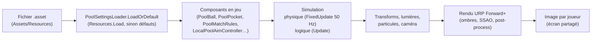

# Des fichiers de configuration au rendu final

> Comment une valeur réglée dans un fichier de configuration (ScriptableObject) finit par changer ce que le joueur voit à l'écran.

## Le principe

Un **ScriptableObject** est un fichier de données Unity (`.asset`) modifiable dans l'Inspector, indépendant des scènes. Le projet s'en sert pour deux choses :

1. **Les réglages partagés** — un seul fichier par thème, placé dans `Assets/Resources`, chargé au démarrage.
2. **Les pouvoirs** — un fichier par pouvoir (`Assets/Powers`), chacun avec ses propres valeurs.

Avantages : on règle sans toucher au code ni aux scènes, les mêmes valeurs servent partout, et un fichier manquant ne casse rien (valeurs par défaut).

## Chaîne complète

1. **Création** : **Tools > Pool > Ensure Config Assets Exist** crée les fichiers manquants (sans toucher aux existants).
2. **Chargement** : chaque composant appelle `PoolSettingsLoader.LoadOrDefault<T>("Nom")` dans son `Awake`. Si le fichier n'existe pas : avertissement dans la console et valeurs par défaut du code.
3. **Utilisation** : les valeurs sont lues pendant le jeu (pas de copie figée) — modifier l'asset en Play Mode se voit immédiatement, et la modification est conservée après l'arrêt (propriété des ScriptableObjects).
4. **Effet visible** : selon le réglage, il agit sur la physique, sur une lumière, sur des particules ou sur la caméra, puis passe par le rendu URP comme le reste de la scène.

## Les fichiers de configuration

### PoolPhysicsSettings — comportement des billes

| Champ | Défaut | Effet |
|---|---|---|
| `slideFriction` | 6 | Freinage tant que la bille glisse (avant de rouler) |
| `friction` | 2 | Résistance au roulement une fois qu'elle roule |
| `sleepVelocityThreshold` | 0,01 | Vitesse sous laquelle la bille est arrêtée net |
| `offTableDropThreshold` | 0,15 | Chute sous laquelle une bille sortie de table est considérée empochée |

Lu par `PoolBall.FixedUpdate` → modifie `Rigidbody.linearVelocity` / `angularVelocity` → la position rendue de la bille.

### PoolScreenJuiceSettings — sensations caméra et écran

Vision brouillée (couleur, clignotement, secousse), zoom et secousse de charge, secousse au tir, à l'empochage, à la faute (plus flash rouge), au ramassage de pouvoir (flash cyan).

Lu par `LocalPoolPowerEffectReceiver` (secousses, voiles plein écran) et `LocalPoolAimController` (zoom de charge) → position de la caméra et calque `OnGUI` par-dessus l'image.

### PoolPotEffectSettings — bille empochée et poches

Halo lumineux (couleur, intensité, portée, durée), aura qui monte (prefab Cartoon FX, durée, échelle, vitesse), surbrillance de la poche sélectionnée, visuel de poche fermée (prefab optionnel + échelle), ralenti (échelle de temps, durée).

Lu par `PoolPocket` (lumière ponctuelle + particules) et `PoolMatchRules` (`Time.timeScale` pour le ralenti).

### PoolPowerSpawnSettings — apparition des pouvoirs

Liste des pouvoirs disponibles, couleur par catégorie, nombre de caisses et délais de réapparition, prefab de caisse par catégorie, intervalle de rotation de la bille à pouvoir, intensité et portée de son halo, matériau de bille par catégorie.

Lu par `PoolPowerCrateManager`, `PoolPowerBallRotator`, `PoolPowerCrate`, `PowerBall` → objets instanciés, couleur des lumières, matériau affiché.

### Les pouvoirs (PoolPower)

Chaque pouvoir est son propre asset (`Create > Pool > Powers > …`) : nom, `Requires Own Turn`, et ses paramètres. Exemples :
- tir boosté : multiplicateur de puissance ;
- vision brouillée : multiplicateur de sensibilité ;
- bille destructrice : VFX d'explosion et son échelle, bille 8 épargnée, souffle (vitesse et rayon).

### HudSettings — UI en jeu

Tout ce qu'affiche le HUD (`MatchHud`) et comment :
- **polices et taille** : polices, taille globale, taille des interjections, de « À toi ! » et des bandeaux ;
- **couleurs** : joueurs, encre, cartes, mise en avant, danger, « BOUM ! », voile du joueur qui attend, jauge ;
- **textes** : tour, plaque, bandeaux d'aide, interjections (liste tirée au hasard pour une bille rentrée), carte sponsor, fin de partie. `{0}` est remplacé par le numéro du joueur, la poche ou la catégorie du pouvoir ; un texte vidé désactive l'interjection ou le bandeau correspondant ;
- **interrupteurs** : interjections de bille rentrée, carte sponsor, confettis, voile ; seuil du tir plein ;
- **durées** : interjections, rayons, carte sponsor, délai « FAUTE ! » → « Main libre ! », secousse, balancement de « À toi ! ».

Lu par `MatchHud` : les textes, couleurs et tailles à la construction du HUD, donc à la scène suivante ; les durées à chaque image.

### MenuSettings — menu, pause, écran des touches

Textes et billes du menu principal, de la pause et de *Réglages > Touches* ; palette, polices, image de fond, lumières du bar, logo ; durées (messages, vitesse du tir, clignotement).

Lu par `UiKit` (palette et polices, donc aussi l'écran de chargement), `SyntheseMenu`, `PauseMenu` et `KeyBindingsPanel` à leur construction, donc au prochain lancement ; les durées à chaque image. Les niveaux restent dans `GameFlowSettings`, les textes du chargement dans `LoadingScreenSettings`.

### TextFxSettings — texte animé

Force et vitesse des sept effets permanents (`<wave>`, `<shake>`…), apparition par défaut des lettres, durées et décalages, machine à écrire (lettres par seconde, pauses de ponctuation), disparition.

Lu par `TextFx` à chaque image, au moment de déplacer les sommets des lettres : un changement se voit tout de suite en Play Mode.

## Réglages qui ne sont pas (encore) des ScriptableObjects

- **Table** : dimensions dans `PoolTableAssetSettings` (ScriptableObject **d'éditeur**, utilisé seulement par `PoolTableBuilder`).
- **Visée, joueur, ragdoll** : champs sérialisés directement sur les composants du prefab joueur (distances de visée, vitesses, offsets de la queue, priorités de caméra…).
- **Matériaux physiques** (rebond et frottement des billes, bandes, tapis) : fichiers `PhysicsMaterial` générés par `PoolTableBuilder`.

Piste (voir *Pistes & suggestions*) : regrouper les réglages de visée et de joueur dans des ScriptableObjects, et décrire les dimensions et les niveaux de la même façon — ce serait la base de l'outil de niveau.
