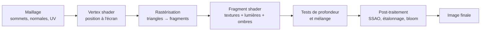

# Techniques de rendu

> Les notions de base, puis la configuration réellement utilisée par le projet (`Assets/Settings/PC_RPAsset.asset`, `PC_Renderer.asset`, `ProjectSettings/QualitySettings.asset`).

## Du modèle 3D au pixel

- **Vertex (sommet)** : point d'un maillage, avec une position, une normale (orientation de la surface) et des coordonnées de texture (UV). Le *vertex shader* le projette à l'écran ; il sert aussi aux déformations (vent, skinning des personnages).
- **Fragment (pixel)** : le *fragment shader* calcule la couleur de chaque pixel couvert par un triangle à partir des textures, des lumières et des ombres. C'est en général la partie la plus coûteuse.
- **Shader** : programme exécuté par la carte graphique. Dans URP, les matériaux utilisent surtout le shader **Lit** (rendu physique, PBR) ; **Shader Graph** permet d'en créer visuellement.
- **Textures** : images appliquées via les UV — couleur (*albedo*), relief (*normal map*), métal/rugosité, occlusion. Les **mipmaps** (versions réduites) évitent le scintillement au loin ; la **compression** réduit la mémoire vidéo.
- **Lumières** : directionnelle (soleil), ponctuelles, spots. En temps réel (recalculées chaque image) ou **précalculées** (*lightmaps*, *light probes*) pour un coût quasi nul en jeu.
- **Ombres** : rendues via des *shadow maps* (la scène vue depuis la lumière, en profondeur). Les **cascades** découpent la distance pour garder des ombres nettes près de la caméra ; le **bias** évite les artefacts (acné d'ombre, décollement).
- **Reflection probes** : captures de l'environnement pour les reflets (billes brillantes, bois verni).
- **Post-traitement** : effets appliqués à l'image entière (occlusion ambiante, étalonnage des couleurs, flou…), réglés par des *Volumes* URP.

## Configuration du projet

### Pipeline

| Réglage | Valeur | Commentaire |
|---|---|---|
| Pipeline | URP 17.6 | Deux niveaux de qualité : **PC** (actif) et **Mobile** |
| Chemin de rendu | **Forward+** | Les lumières sont triées par tuiles d'écran : beaucoup de lumières ponctuelles possibles sans multiplier le coût par objet (utile pour les halos de poches et de billes à pouvoir) |
| HDR | Activé | Nécessaire pour des halos lumineux intenses et un bloom crédible |
| MSAA (anticrénelage) | Désactivé | Arêtes crénelées possibles ; alternative : FXAA/SMAA en post-process sur la caméra |
| Render scale | 1 | Pleine résolution |
| Depth texture / Opaque texture | Activées | Requises par le SSAO et certains effets VFX (distorsion, particules douces) ; coût mémoire et copie supplémentaires |
| SRP Batcher | Activé | Réduit le coût CPU des appels de dessin pour les matériaux compatibles |
| Dynamic batching | Désactivé | Normal avec le SRP Batcher |
| GPU Resident Drawer | Désactivé | Option Unity 6 pour les scènes très chargées ; non nécessaire aujourd'hui |

### Lumières et ombres

| Réglage | Valeur |
|---|---|
| Lumière principale | Par pixel, ombres activées, shadow map **2048** |
| Lumières additionnelles | Par pixel, **4 par objet** max, ombres activées (atlas 2048) |
| Distance des ombres | 50 m, **4 cascades** (12 % / 29 % / 54 %) |
| Ombres douces | Qualité haute |
| Bias | profondeur 0,1 / normale 0,5 |
| Cookies de lumière | Activés |
| Reflection probes | Mélange et projection en boîte activés |

Pour une salle de billard, 50 m d'ombres est largement supérieur au besoin : réduire à 15–20 m (et 2 cascades) donnerait des ombres plus nettes sur la table pour un coût moindre (voir *Performances*).

### Effets du renderer

- **SSAO** (Screen Space Ambient Occlusion) : assombrit les recoins et contacts (billes sur le tapis, pieds de table).

### Écran partagé

Chaque joueur a sa propre caméra : **la scène est rendue deux fois par image**, chacune sur la moitié de l'écran. Tout coût par caméra (ombres, SSAO, post-process) est donc doublé. La hauteur de la vue de dessus est corrigée selon la forme du demi-écran (`PlacementHeightForCurrentViewport`).

## Éléments visuels propres au jeu

| Élément | Technique |
|---|---|
| **Numéros des billes** | Texture générée par l'éditeur (`PoolBallTextureGenerator`) : couleur pleine ou bande blanche + numéro, 256×128, sans mipmaps, écrite en PNG dans `Assets/Textures/Balls` |
| **Halo de poche** | Lumière ponctuelle dont l'intensité décroît sur la durée (`PoolPocket`), réutilisée pour la surbrillance de sélection |
| **Aura qui monte** | Système de particules Cartoon FX instancié à la poche |
| **Bille à pouvoir** | Lumière ponctuelle enfant + échange de matériau par catégorie (`sharedMaterial`, sans créer de copie) |
| **Poche fermée** | Prefab optionnel, sinon cylindre rouge généré au lancement |
| **Voiles d'écran** (vision brouillée, flashs) | Rectangle plein écran dessiné en `OnGUI` avec transparence |
| **Ligne de trajectoire** | `LineRenderer` |
| **Corps du joueur** | Maillage skinné (animations Mixamo) déformé par l'IK et, en chute, par PuppetMaster |

## Pistes

- Précalculer l'éclairage de la salle (**lightmaps**) et ne garder en temps réel que les lumières dynamiques (halos, effets).
- Activer un anticrénelage post-process léger (FXAA) — les bords fins de la queue et des bandes crénèlent sans MSAA.
- Remplacer les voiles `OnGUI` par un effet de post-process ou un canvas UI (meilleure intégration, pas de coût `OnGUI`).
