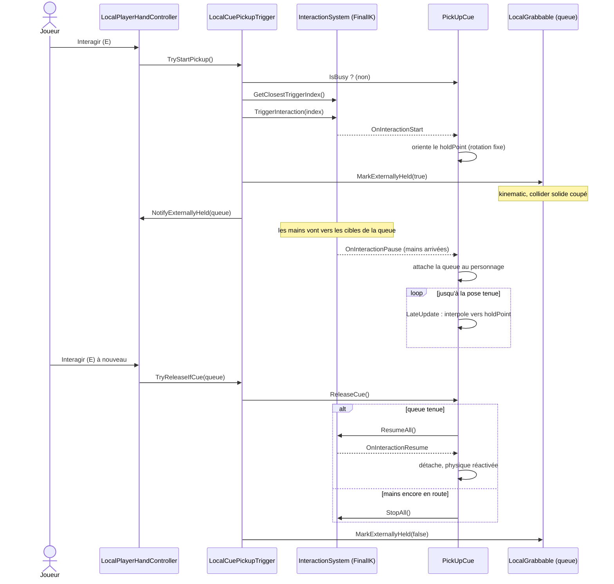
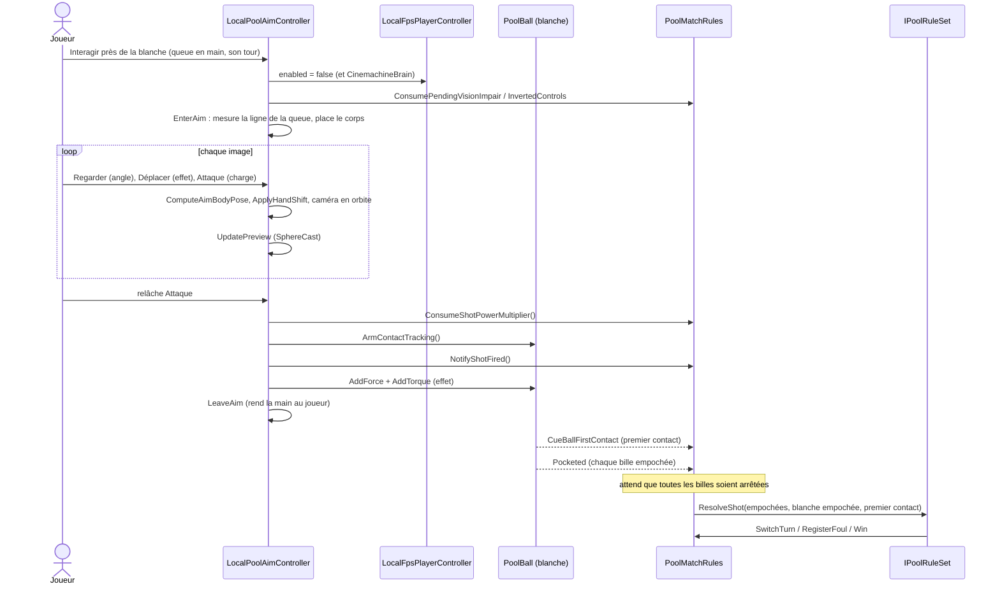
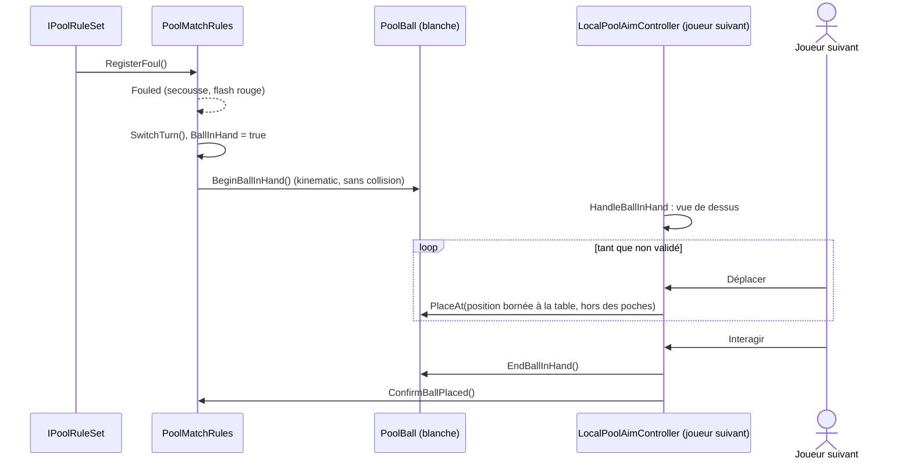
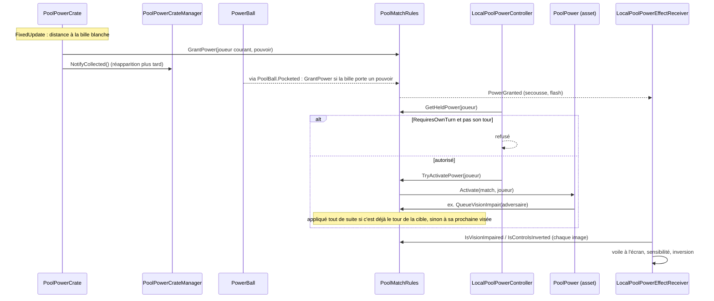
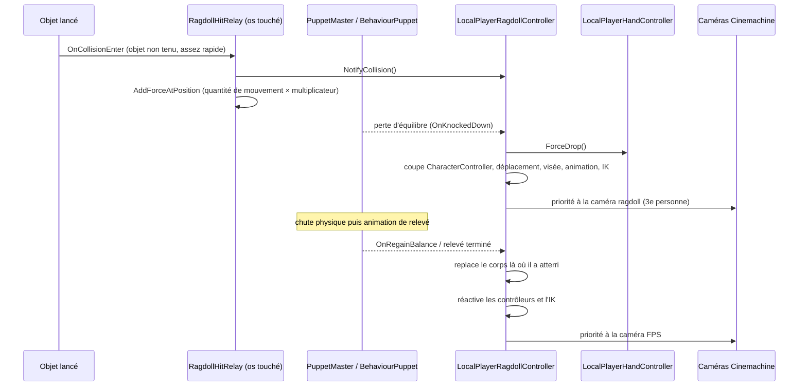

# Diagrammes de séquence

> Les échanges entre composants pour les moments clés d'une partie. Noms de méthodes tels qu'ils sont dans le code.

## Ramasser et lâcher la queue

Le cas « mains encore en route » est le correctif du 28/09 : avant, un second appui pendant le geste laissait la queue dans la main sans que le jeu le sache.

## Viser et tirer

Le tir n'est reconnu **que** par `NotifyShotFired()` : le simple mouvement des billes au démarrage ne compte plus comme un tir (bug de fausse faute corrigé).

## Faute et main libre

L'annonce de poche de la bille 8 suit le même schéma (vue de dessus, sélection avec Déplacer, validation avec Interagir → `CallEightBallPocket`).

## Pouvoirs : ramasser et activer

## Chute en ragdoll et relevé

`LocalPoolAimController.OnDisable` sort proprement de la visée ou du placement si la chute arrive pendant ces modes (caméra et Cinemachine rétablis).
