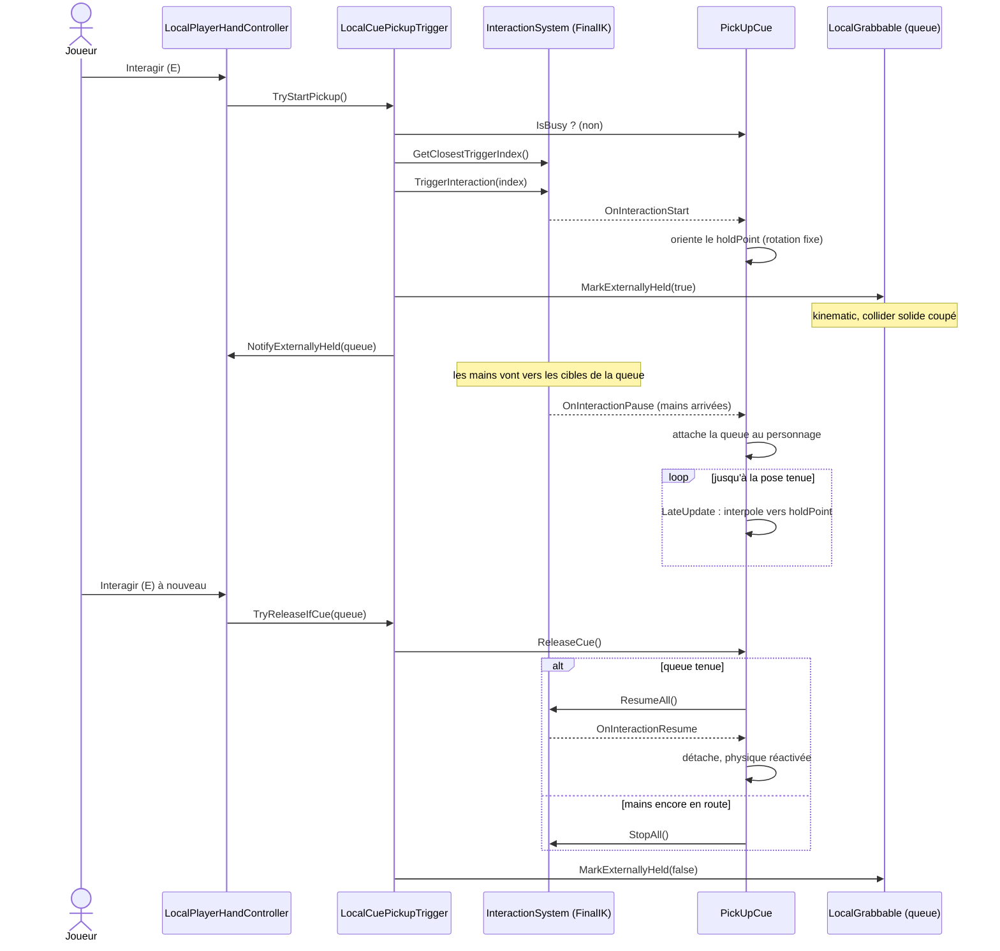
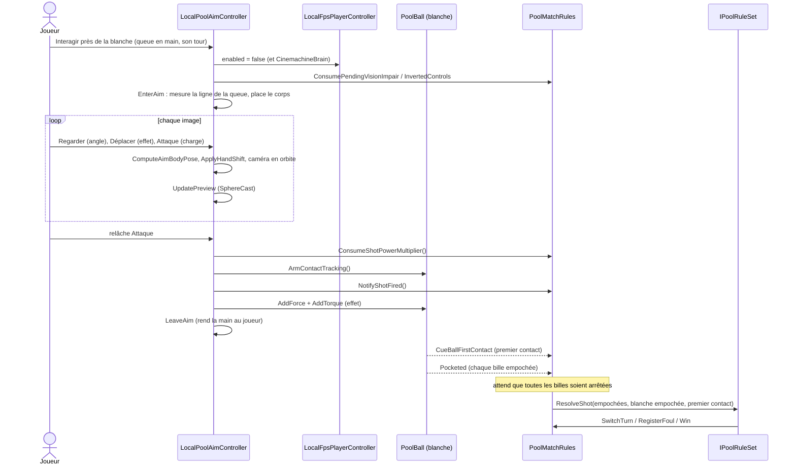
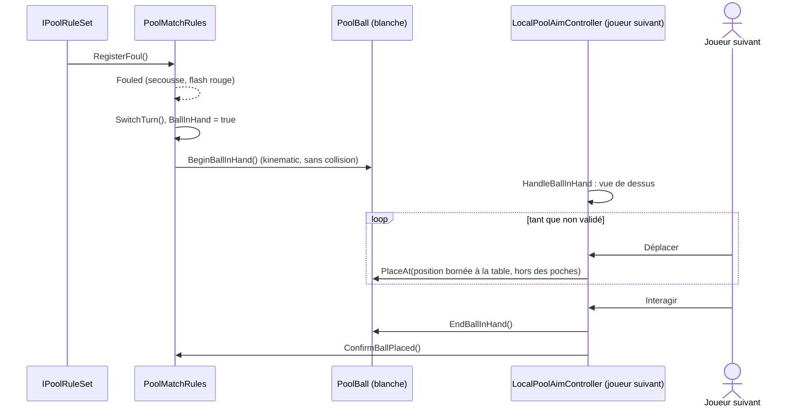
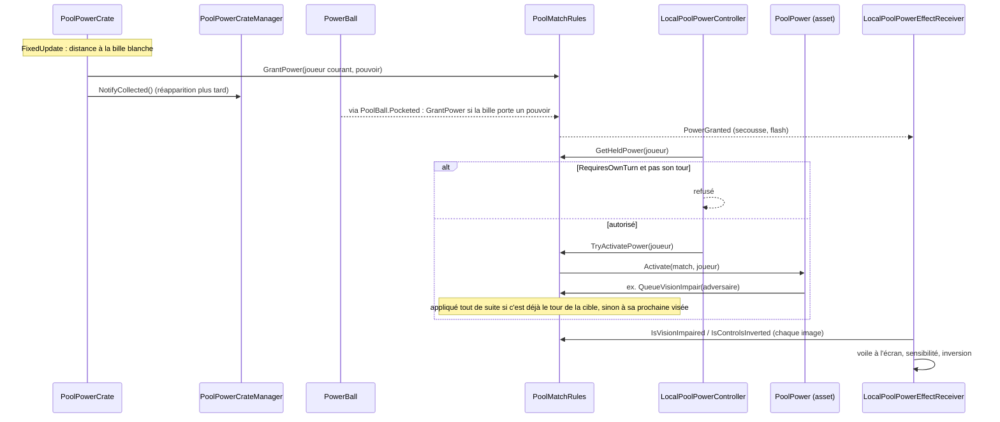
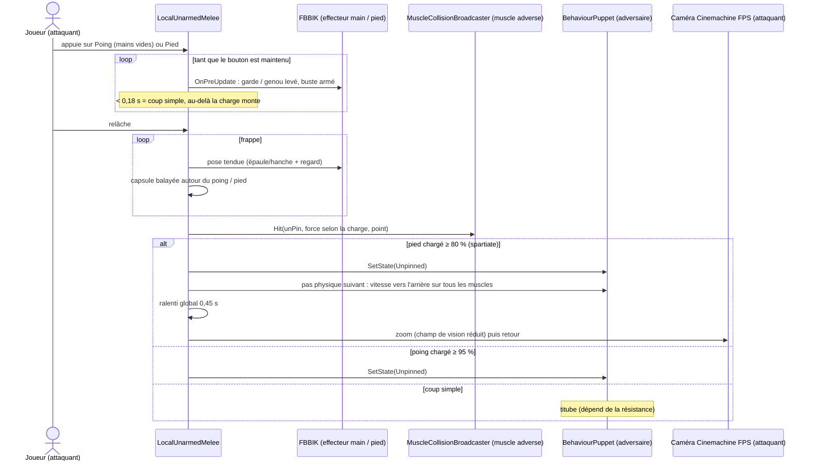
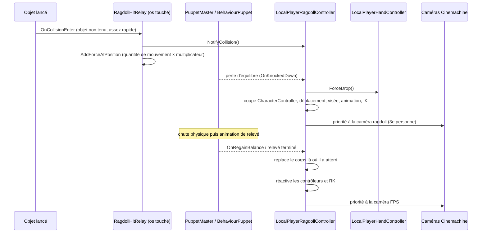

# Diagrammes de séquence

> Les échanges entre composants pour les moments clés d'une partie. Noms de méthodes tels qu'ils sont dans le code.

## Ramasser et lâcher la queue



Le cas « mains encore en route » est le correctif du 28/09 : avant, un second appui pendant le geste laissait la queue dans la main sans que le jeu le sache.

## Viser et tirer



Le tir n'est reconnu **que** par `NotifyShotFired()` : le simple mouvement des billes au démarrage ne compte plus comme un tir (bug de fausse faute corrigé).

## Faute et main libre



L'annonce de poche de la bille 8 suit le même schéma (vue de dessus, sélection avec Déplacer, validation avec Interagir → `CallEightBallPocket`).

## Pouvoirs : ramasser et activer



## Coup de queue sur l'autre joueur

```mermaid
sequenceDiagram
  actor J as Joueur (attaquant)
  participant M as LocalCueMelee
  participant Q as Queue tenue
  participant B as MuscleCollisionBroadcaster (muscle adverse)
  participant BP as BehaviourPuppet (adversaire)
  participant RC as LocalPlayerRagdollController (adversaire)

  J->>M: appuie sur Attaque (queue en main, hors visée)
  M->>M: mémorise l'orientation de la vue
  loop tant qu'Attaque est maintenue
    J->>M: tourne (Regarder)
    M->>M: 1re rotation nette fixe le coup (droite → balayage vers la gauche, gauche → vers la droite, haut → vertical ; sinon estoc)
    M->>Q: armé de plus en plus loin (charge 0 → 1), dans le repère de la caméra
    Note over Q: FBBIK : les mains suivent
  end
  J->>M: relâche Attaque
  M->>M: cible = vue de l'appui, ou adversaire dans le cône d'assistance
  loop frappe puis retour
    M->>M: LocalFpsPlayerController.AddLook : la vue revient vers la cible
    M->>Q: arc vers la fin du geste (estoc : pointe en avant, position de tir)
    M->>M: capsule mains → pointe (OverlapCapsule, sous-pas)
  end
  M->>B: Hit(unPin, force selon la charge, point)
  opt charge ≥ 90 %
    M->>BP: SetState(Unpinned) : chute garantie
  end
  B->>BP: OnMuscleHit : dépose le muscle et ses voisins, applique la force
  alt coup léger
    BP-->>BP: titube puis se rééquilibre
  else coup avec élan
    BP-->>RC: perte d'équilibre (OnKnockedDown)
    Note over RC: suite identique à la chute ci-dessous
  end
```

## Poing, pied et coup de pied spartiate



## Chute en ragdoll et relevé



`LocalPoolAimController.OnDisable` sort proprement de la visée ou du placement si la chute arrive pendant ces modes (caméra et Cinemachine rétablis).
